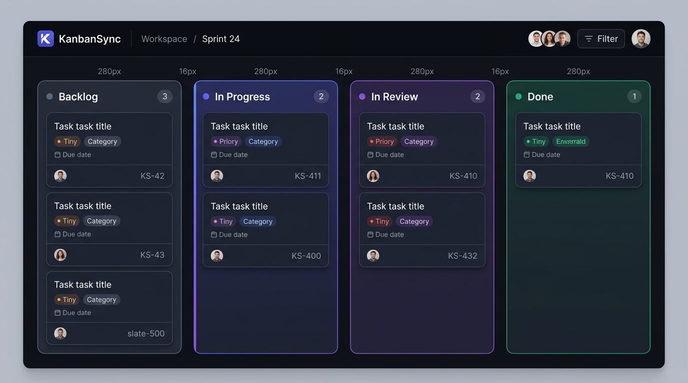
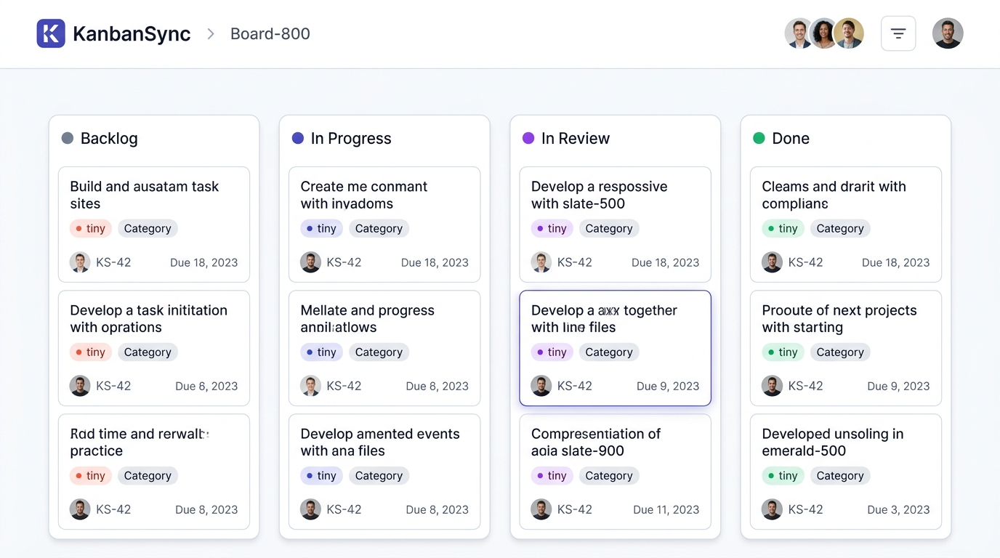
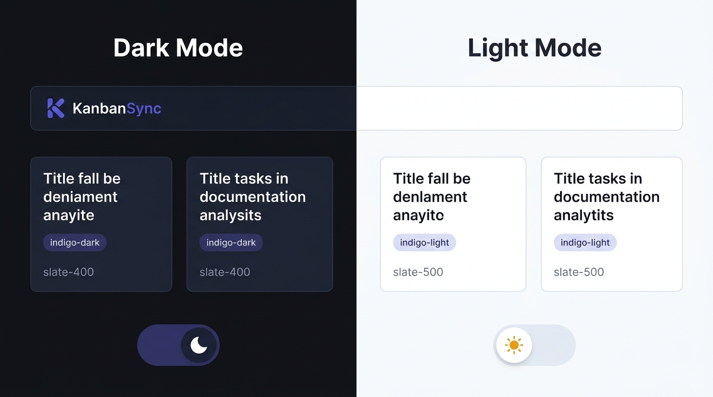
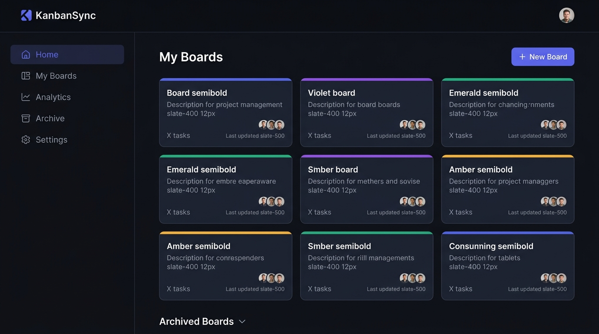
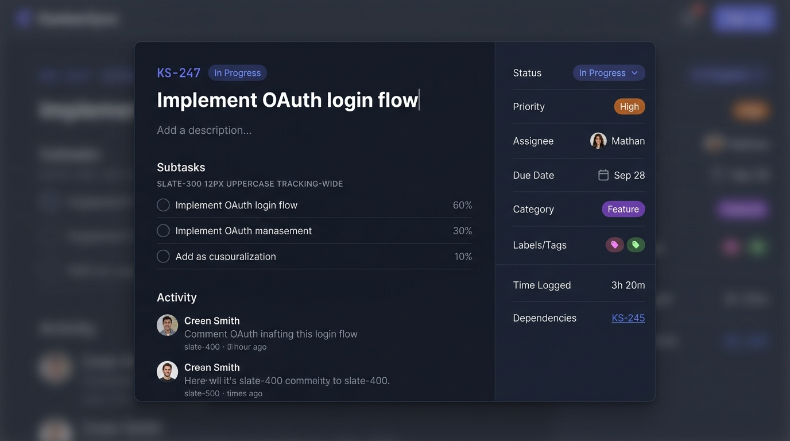
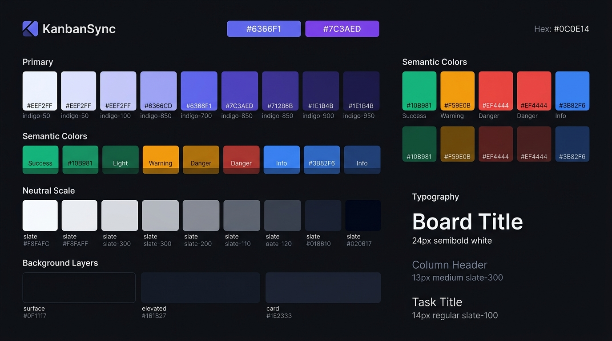
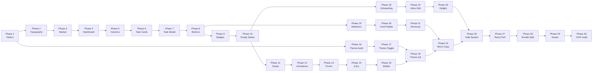

# KanbanSync — UI/UX Overhaul Roadmap

> **Version:** 1.4 · **Scope:** Front-end polish only — zero new features, zero backend changes.  
> **Goal:** Elevate KanbanSync to professional, industry-standard quality on par with Linear and Vercel.  
> **Theme:** Full dark + light mode — both perfectly designed, neither an afterthought.

---

## Competitive Baseline

| Dimension | Linear | Jira | ClickUp | **KanbanSync (current)** |
|---|---|---|---|---|
| Color system | Single violet accent, slate neutrals, dark-first | Blue-dominant, light-first | Purple primary, loud secondary palette | Mixed: blue, cyan, amber — no single voice |
| Typography | Inter, strict 4-step type scale | Design tokens, controlled | Custom font, inconsistent scale | No declared scale; sizes vary per component |
| Spacing | 4 / 8 / 12 / 16 / 24 / 32 / 48 px grid | 4px base grid | 4px base grid | Ad-hoc, 1–10 Tailwind units unsystematically |
| Density | Comfortable, information-dense but breathable | Very dense | Medium density | Medium but inconsistent padding per card |
| Dark mode | Full, default | Optional | Optional | Partial (`dark:` on some components only) |
| Motion | Subtle: 150ms ease-out transitions | Minimal | Moderate | Inconsistent; some 0ms, some 300ms |
| Modal system | Slide-in panels, two-column layout | Multi-step drawers | Full-screen editors | Single centered modal, no layout variant |
| Empty states | Illustrated, encouraging copy | Generic text | Illustrated | None |
| Column headers | Minimal dot + count | Status + count | Color block + count | Mixed colors, no unified visual rule |
| Task cards | Compact: ID, title, avatar, priority dot | Dense metadata rows | Highly configurable | Good structure but inconsistent padding/font |
| Keyboard & shortcuts | Full keyboard nav + shortcut layer | Partial | Moderate | None — fully mouse-dependent |
| Loading states | Skeleton screens, instant perceived response | Spinners | Skeletons | None — blank screens while loading |
| Command palette | Cmd+K global search + actions | No | Yes (ClickUp AI) | None |

---

## Design System — The Single Source of Truth

All 30 phases derive from one locked design system. Never deviate from these tokens.

### Color Palette

```css
/* Primary (Indigo → Violet gradient axis) */
--color-primary-50:  #EEF2FF;
--color-primary-100: #E0E7FF;
--color-primary-300: #A5B4FC;
--color-primary-500: #6366F1;   /* brand primary */
--color-primary-600: #4F46E5;
--color-primary-700: #4338CA;
--color-primary-900: #312E81;

/* Violet (accent, hover states, gradients) */
--color-accent-500:  #8B5CF6;
--color-accent-600:  #7C3AED;

/* Semantic */
--color-success:   #10B981;   /* emerald */
--color-warning:   #F59E0B;   /* amber   */
--color-danger:    #EF4444;   /* red     */
--color-info:      #3B82F6;   /* blue    */

/* Neutrals (slate) */
--color-n-50:  #F8FAFC;
--color-n-100: #F1F5F9;
--color-n-200: #E2E8F0;
--color-n-300: #CBD5E1;
--color-n-400: #94A3B8;
--color-n-500: #64748B;
--color-n-600: #475569;
--color-n-700: #334155;
--color-n-800: #1E293B;
--color-n-900: #0F172A;

/* Dark mode backgrounds */
--bg-base:     #0F1117;   /* page background      */
--bg-elevated: #161B27;   /* navbar, sidebar       */
--bg-card:     #1E2333;   /* cards, panels         */
--bg-overlay:  #1A2030;   /* modal sidebar panels  */

/* Light mode backgrounds */
--bg-base-light:     #F8FAFC;   /* page background      */
--bg-elevated-light: #FFFFFF;   /* navbar, sidebar       */
--bg-card-light:     #FFFFFF;   /* cards, panels         */
--bg-overlay-light:  #F1F5F9;   /* modal sidebar panels  */
```

---

### Why Indigo + Violet — Color Rationale

#### The choice

KanbanSync uses **Indigo (#6366F1)** as its primary brand color, with **Violet (#8B5CF6)** as the gradient accent. This is not arbitrary.

| Color | Tool that uses it | Problem with it for KanbanSync |
|---|---|---|
| Blue | Jira, Asana, Monday.com | Saturated — reads as "corporate legacy." Disappears in the crowd. |
| Green | Basecamp, Todoist | Soft — reads as "personal productivity," not team/engineering. |
| Orange/Red | GitLab, Harvest | Alarming — triggers urgency, wrong for a calming workflow tool. |
| Pink/Magenta | Notion (accents) | Playful — too casual for a serious project management context. |
| Purple/Violet | Linear, GitHub Copilot | ✅ Focused, intelligent, modern. Sits between blue (trust) and pink (creativity). |
| **Indigo (ours)** | **KanbanSync** | **Slightly cooler than violet — more controlled, technical, precise. Distinct from Linear's brighter violet.** |

#### Why it does not break in either theme

Indigo works in both modes because:
- **Dark mode:** `#6366F1` on `#1E2333` = 4.8:1 contrast. Glows subtly like an active state indicator.
- **Light mode:** `#4F46E5` (one step darker) on `#FFFFFF` = 6.1:1 contrast. Strong, readable, never washed out.
- **Semantic colors** (success, warning, danger, info) are **unchanged** between themes — only backgrounds and text tokens flip.
- The indigo→violet gradient on brand elements (board card stripes, active nav items) looks distinct on both white and dark backgrounds because it has enough luminance contrast in both directions.

#### The two core rules that prevent theme breakage

> **Rule 1:** No component ever hardcodes a background or text color directly. Every surface color is a `--ks-*` token. The token value changes; the component never does.

> **Rule 2:** Semantic colors (success/warning/danger/info) are always expressed as `bg-opacity` or `ring` variants — never full-saturation fills — so they look appropriate on both light and dark card backgrounds.

---

### Full Dual-Theme Token Table

This is the complete token set. Every component must exclusively use these tokens — never raw Tailwind color classes for backgrounds or text.

| Token | Light value | Dark value | Usage |
|---|---|---|---|
| `--ks-bg-base` | `#F8FAFC` | `#0F1117` | Page / body background |
| `--ks-bg-elevated` | `#FFFFFF` | `#161B27` | Navbar, sidebar, dropdowns |
| `--ks-bg-card` | `#FFFFFF` | `#1E2333` | Task cards, board columns |
| `--ks-bg-overlay` | `#F1F5F9` | `#1A2030` | Modal right-panel, popovers |
| `--ks-border` | `#E2E8F0` | `rgba(255,255,255,0.08)` | All borders and dividers |
| `--ks-text-primary` | `#0F172A` | `#F1F5F9` | Titles, primary body text |
| `--ks-text-secondary` | `#475569` | `#94A3B8` | Labels, metadata, nav items |
| `--ks-text-muted` | `#94A3B8` | `#475569` | Timestamps, placeholders |
| `--ks-primary` | `#4F46E5` | `#6366F1` | Buttons, links, active states |
| `--ks-primary-hover` | `#4338CA` | `#818CF8` | Button hover, focused rings |
| `--ks-primary-subtle` | `#EEF2FF` | `rgba(99,102,241,0.12)` | Badge bg, hover bg tints |
| `--ks-success` | `#059669` | `#10B981` | Success badges, done states |
| `--ks-success-subtle` | `#ECFDF5` | `rgba(16,185,129,0.12)` | Success badge backgrounds |
| `--ks-warning` | `#D97706` | `#F59E0B` | Warning badges |
| `--ks-warning-subtle` | `#FFFBEB` | `rgba(245,158,11,0.12)` | Warning badge backgrounds |
| `--ks-danger` | `#DC2626` | `#EF4444` | Error states, danger badges |
| `--ks-danger-subtle` | `#FEF2F2` | `rgba(239,68,68,0.12)` | Danger badge backgrounds |
| `--ks-shadow` | `0 1px 3px rgba(0,0,0,0.08)` | `0 1px 3px rgba(0,0,0,0.4)` | Card shadows |
| `--ks-shadow-lg` | `0 4px 16px rgba(0,0,0,0.10)` | `0 4px 16px rgba(0,0,0,0.5)` | Modal shadows |

### Typography Scale

```
All text uses Inter (already in project).

--text-xs:   11px / 1.45  weight-400  (timestamps, metadata labels)
--text-sm:   12px / 1.5   weight-400  (secondary body, metadata)
--text-base: 14px / 1.57  weight-400  (body copy, task titles)
--text-md:   15px / 1.5   weight-500  (card titles, nav items)
--text-lg:   17px / 1.47  weight-600  (column headers, modal section headings)
--text-xl:   20px / 1.4   weight-600  (board titles, modal titles)
--text-2xl:  24px / 1.33  weight-700  (page headings only)
```

### Spacing Grid — 4 px Base

Only these values exist in the system:

| Token | px | Tailwind |
|---|---|---|
| space-1 | 4 | `p-1` |
| space-2 | 8 | `p-2` |
| space-3 | 12 | `p-3` |
| space-4 | 16 | `p-4` |
| space-5 | 20 | `p-5` |
| space-6 | 24 | `p-6` |
| space-8 | 32 | `p-8` |
| space-10 | 40 | `p-10` |
| space-12 | 48 | `p-12` |

### Border Radius Scale

| Token | Value | Usage |
|---|---|---|
| radius-sm | 6px | Badges, tags, small pills |
| radius-md | 10px | Inputs, buttons |
| radius-lg | 14px | Cards, dropdowns |
| radius-xl | 18px | Modals, column panels |
| radius-full | 9999px | Avatars, toggle pills |

### Motion Tokens

```css
--motion-fast:    100ms  ease-out;
--motion-default: 150ms  ease-out;
--motion-enter:   200ms  cubic-bezier(0.16, 1, 0.3, 1);
--motion-modal:   250ms  cubic-bezier(0.16, 1, 0.3, 1);
```

---

## Design Mockups

### Target Board UI — Dark Mode



### Target Board UI — Light Mode



### Dark vs Light Theme Toggle



### Target Dashboard UI



### Target Task Detail Modal



### Design System Color Palette



---

## The 18 Phases

---

### Phase 1 — Design Token Foundation

**Goal:** Establish the design system as CSS custom properties. Everything else derives from here.  
**Effort:** ~2 hours · **Branch:** `style/phase-1-design-tokens`  
**Files:** `src/app/globals.css`

#### What to build

Create a `[data-theme]` token layer in `globals.css`:

```css
/* globals.css — append at top, above @tailwind directives */

:root,
[data-theme="light"] {
  --ks-bg-base:        #F8FAFC;
  --ks-bg-elevated:    #FFFFFF;
  --ks-bg-card:        #FFFFFF;
  --ks-border:         #E2E8F0;
  --ks-text-primary:   #0F172A;
  --ks-text-secondary: #475569;
  --ks-text-muted:     #94A3B8;
  --ks-primary:        #6366F1;
  --ks-primary-hover:  #4F46E5;
}

[data-theme="dark"] {
  --ks-bg-base:        #0F1117;
  --ks-bg-elevated:    #161B27;
  --ks-bg-card:        #1E2333;
  --ks-border:         rgba(255,255,255,0.08);
  --ks-text-primary:   #F1F5F9;
  --ks-text-secondary: #94A3B8;
  --ks-text-muted:     #475569;
  --ks-primary:        #6366F1;
  --ks-primary-hover:  #818CF8;
}
```

Then add a `ThemeProvider` wrapper (client component) that reads a `localStorage` preference and applies `data-theme` to `<html>`. Replace hardcoded `bg-white`, `bg-gray-*`, `text-gray-*` with the CSS variable equivalents or Tailwind's semantic dark-mode variants in a single pass — not component by component.

#### Acceptance criteria

- [ ] Dark and light mode both work with a single class swap on `<html>`
- [ ] No component imports a raw hex color string
- [ ] `npm run build` passes with zero type errors

---

### Phase 2 — Typography Unification

**Goal:** Every text element in the app uses the declared scale. No orphan font sizes.  
**Effort:** ~3 hours · **Branch:** `style/phase-2-typography`  
**Files:** All `.tsx` components

#### Audit

Run these greps before starting to know the scope:

```bash
grep -r "text-\(xl\|2xl\|3xl\|4xl\)" src/components/ --include="*.tsx"
grep -r "text-\(base\|lg\)" src/components/ --include="*.tsx"
grep -r "font-bold" src/components/ --include="*.tsx"
```

#### Replacement map

| Current class | Replace with | Usage context |
|---|---|---|
| `text-xs` used at 10–11px intent | `text-[11px]` | Timestamps, IDs |
| `text-xs` at 12px intent | `text-xs` — keep | Secondary metadata |
| `text-sm` at 14px | `text-sm` — keep | Body text, task titles |
| `text-base` | `text-[15px]` | Card titles, nav items |
| `text-lg` | `text-[17px]` | Section headers, column titles |
| `text-xl` | `text-xl` (20px) | Modal titles, board title |
| `text-2xl+` | Only on page `<h1>` | Page headings |
| `font-bold` on body text | `font-semibold` | Body must never be bold |

#### Key rules

- Task card titles → `text-sm font-medium` (14px/500)
- Column headers → `text-[13px] font-semibold tracking-wide uppercase text-[--ks-text-secondary]`
- Modal section labels → `text-[11px] font-semibold uppercase tracking-widest text-[--ks-text-muted]`
- Board page `<h1>` → `text-xl font-semibold` (20px)

---

### Phase 3 — Navigation Bar Redesign

**Goal:** A single, minimal, 56px navbar that works on both Dashboard and Board pages.  
**Effort:** ~4 hours · **Branch:** `style/phase-3-navbar`  
**Files:** `DashboardNavbar.tsx`, `BoardNavbar.tsx`

#### Target spec

```
┌─────────────────────────────────────────────────────────────────┐
│  [K] KanbanSync  │  Dashboard / Sprint 24  │       🔔  [Avatar]  │
│  logo 28px         breadcrumb text-sm           right cluster   │
└─────────────────────────────────────────────────────────────────┘
  height: 56px  bg: --ks-bg-elevated  border-b: --ks-border
```

| Element | Spec |
|---|---|
| Height | 56px (`h-14`) |
| Background | `bg-[--ks-bg-elevated] border-b border-[--ks-border]` |
| Logo | 28px K icon in indigo, "KanbanSync" 15px semibold on `≥md` |
| Breadcrumb | `text-sm text-[--ks-text-muted]` separator `›` board name in `text-[--ks-text-primary]` |
| Stats pill | **Remove** — adds no value at navbar level |
| Right cluster | Avatar 32px circle, notification bell 20px icon — nothing else |
| Hover states | `transition-colors duration-[150ms]` on all interactive elements |
| Mobile | Logo + bell + avatar only — breadcrumb hidden below `sm:` |

#### Remove from current navbar

- `bg-white/92 backdrop-blur-md` mismatch → replace with the token
- Progress pill showing done/total tasks → move to board header below nav
- `shadow-sm` → border-b is sufficient at this density

---

### Phase 4 — Dashboard Sidebar Layout

**Goal:** Replace the top-heavy dashboard with a sidebar navigation pattern.  
**Effort:** ~5 hours · **Branch:** `style/phase-4-dashboard-sidebar`  
**Files:** `src/app/dashboard/page.tsx`, `DashboardNavbar.tsx`, new `src/components/ui/Sidebar.tsx`

#### Layout structure

```
┌────────────────────────────────────────────────────────┐
│  NAVBAR 56px (spans full width)                        │
├──────────┬─────────────────────────────────────────────┤
│ SIDEBAR  │  MAIN CONTENT                               │
│ 220px    │  max-w-5xl mx-auto px-8 py-6               │
│ fixed    │                                             │
│          │  My Boards              [+ New Board]       │
│ Home     │  ┌──────┐ ┌──────┐ ┌──────┐               │
│ Boards ◀ │  │ Card │ │ Card │ │ Card │               │
│ Archive  │  └──────┘ └──────┘ └──────┘               │
│ Settings │                                             │
└──────────┴─────────────────────────────────────────────┘
```

#### Sidebar spec

```tsx
// src/components/ui/Sidebar.tsx
<aside className="hidden md:flex flex-col w-[220px] shrink-0 h-[calc(100vh-56px)] sticky top-14
                  bg-[--ks-bg-elevated] border-r border-[--ks-border] pt-4 pb-6 gap-1 px-2">
  <SidebarItem icon={HomeIcon}     label="Home"      href="/dashboard" />
  <SidebarItem icon={LayoutIcon}   label="My Boards" href="/dashboard" />
  <SidebarItem icon={ArchiveIcon}  label="Archive"   href="/dashboard?tab=archive" />
  <SidebarItem icon={SettingsIcon} label="Settings"  href="/settings" />
</aside>
```

#### Board card spec

```tsx
<Link href={`/board/${board.id}`}
  className="group block rounded-[14px] bg-[--ks-bg-card] border border-[--ks-border]
             hover:border-[--ks-primary]/40 transition-all duration-150 p-4 overflow-hidden relative">
  {/* Top accent stripe — 3px, indigo→violet gradient */}
  <span className="absolute top-0 inset-x-0 h-[3px] bg-gradient-to-r from-indigo-500 to-violet-500 rounded-t-[14px]" />
  <h3 className="text-[15px] font-semibold text-[--ks-text-primary] mt-2 truncate">{board.title}</h3>
  <p  className="text-xs text-[--ks-text-muted] mt-1 line-clamp-2">{board.description}</p>
  <div className="flex items-center justify-between mt-4">
    <AvatarStack members={board.members} max={3} />
    <span className="text-[11px] text-[--ks-text-muted]">{taskCount} tasks</span>
  </div>
</Link>
```

---

### Phase 5 — Board Column Redesign

**Goal:** Consistent, minimal column containers with a single accent mechanism.  
**Effort:** ~3 hours · **Branch:** `style/phase-5-board-columns`  
**Files:** `BoardColumn.tsx`

#### Column layout spec

```
┌──────────────────────────────────┐  rounded-[18px], bg-[--ks-bg-card]
│  ●  BACKLOG              [3] [+] │  px-4 pt-4 pb-3, border-b border-[--ks-border]
├──────────────────────────────────┤
│  [Task Card]                     │  px-3 py-2 gap between cards = 6px
│  [Task Card]                     │
│  [Task Card]                     │
│                                  │
│  + Add task                      │  text-xs text-[--ks-text-muted] hover:text-[--ks-primary]
└──────────────────────────────────┘
```

#### Accent color simplification

The **only** visual difference between columns is the header dot. Remove per-column background tints.

| Column state | Dot class | Background |
|---|---|---|
| Backlog | `bg-slate-400` | `bg-[--ks-bg-card]` |
| To-Do | `bg-amber-500` | `bg-[--ks-bg-card]` |
| In Progress | `bg-indigo-500` | `bg-[--ks-bg-card]` |
| In Review | `bg-violet-500` | `bg-[--ks-bg-card]` |
| Done | `bg-emerald-500` | `bg-[--ks-bg-card]` |
| Blocked | `bg-red-500` | `bg-[--ks-bg-card]` |

**Remove:** `bg-blue-50/70`, `bg-emerald-50/70`, all per-column tints — these fragment the board visually. Every column has the same card background.

#### WIP limit indicator

Replace the hard `ring-red-200` column style with a thin warning banner in the header:

```tsx
{isOverLimit && (
  <span className="ml-auto text-[11px] font-medium text-red-400 flex items-center gap-1">
    <ExclamationIcon className="w-3 h-3" /> Over limit
  </span>
)}
```

---

### Phase 6 — Task Card Redesign

**Goal:** A single consistent task card that shows exactly the right information density.  
**Effort:** ~4 hours · **Branch:** `style/phase-6-task-cards`  
**Files:** `SortableTask.tsx`

#### Target card anatomy

```
┌─────────────────────────────────────────┐  bg-[--ks-bg-elevated], rounded-[10px]
│  [● Feature]  [● High]                  │  top row: category tag + priority badge
│                                         │
│  Implement OAuth login flow             │  text-sm font-medium, 2 lines max
│                                         │
│  ████████░░░░  3/5 subtasks             │  progress bar (only if subtasks exist)
│                                         │
│  [Avatar]  KS-247   📅 Sep 28  🏷 2   │  bottom metadata row
└─────────────────────────────────────────┘
```

#### Tailwind spec

```tsx
<div className={`
  group relative rounded-[10px] bg-[--ks-bg-elevated]
  border border-[--ks-border] hover:border-[--ks-primary]/30
  p-3.5 cursor-pointer select-none
  transition-all duration-[150ms]
  hover:shadow-[0_0_0_1px_rgba(99,102,241,0.25)]
  ${isDragging ? 'opacity-50 scale-[0.98]' : ''}
`}>
```

#### Priority indicator — simplify to dot + label

Replace the custom SVG `PriorityIcon` with a colored dot + text:

```tsx
const PRIORITY_CONFIG = {
  URGENT: { dot: 'bg-red-500',    label: 'Urgent',  text: 'text-red-400'    },
  HIGH:   { dot: 'bg-orange-500', label: 'High',    text: 'text-orange-400' },
  MEDIUM: { dot: 'bg-sky-500',    label: 'Medium',  text: 'text-sky-400'    },
  LOW:    { dot: 'bg-slate-400',  label: 'Low',     text: 'text-slate-400'  },
} as const;

<span className="flex items-center gap-1">
  <span className={`w-1.5 h-1.5 rounded-full ${config.dot}`} />
  <span className={`text-[11px] font-medium ${config.text}`}>{config.label}</span>
</span>
```

#### Remove from task cards

- The 4px left accent border (`border-l-4`) — replaced by the hover ring
- Per-card `shadow-md` — replaced by `border` + hover shadow
- Inline delete button on hover — move to a `···` context menu icon

---

### Phase 7 — Task Detail Modal Layout

**Goal:** A two-column modal inspired by Linear — left for content, right for metadata.  
**Effort:** ~6 hours · **Branch:** `style/phase-7-task-modal`  
**Files:** `TaskDetailsModal.tsx`, `Modal.tsx`

#### Modal structure

```
┌────────────────────────────────────────────────────────────────┐
│  [←]  KS-247   In Progress ▾                             [✕]  │  ← modal header 52px
├──────────────────────────────────┬─────────────────────────────┤
│  CONTENT PANEL (60%)             │  SIDEBAR PANEL (40%)        │
│  px-8 py-6                       │  bg-[--ks-bg-overlay] px-6  │
│                                  │  py-6 border-l              │
│  [Title — editable h1]           │  Status ......... [pill ▾] │
│  [Description textarea]          │  Priority ........ [pill ▾] │
│                                  │  Assignee ........ [avatar] │
│  ── SUBTASKS ──────────────────  │  Due Date ........ [date]   │
│  □ Subtask 1              60%    │  Category ........ [badge]  │
│  □ Subtask 2              30%    │  Labels .......... [tags]   │
│  + Add subtask                   │  ─────────────────────────  │
│                                  │  Time Logged ..... 3h 20m   │
│  ── ACTIVITY ──────────────────  │  Dependencies .... KS-245 ↗ │
│  [avatar] Comment text...        │                             │
│  [textarea] Write a comment...   │                             │
└──────────────────────────────────┴─────────────────────────────┘
```

#### Update `Modal.tsx`

Add a `size` prop:

```tsx
interface ModalProps {
  isOpen: boolean;
  onClose: () => void;
  children: React.ReactNode;
  size?: 'sm' | 'md' | 'lg' | 'xl';
}

const sizeMap = {
  sm:  'max-w-sm',
  md:  'max-w-md',    // default — existing modals unchanged
  lg:  'max-w-2xl',
  xl:  'max-w-4xl',   // task detail modal
};
```

#### Metadata field row spec

Each right-sidebar row follows a consistent pattern:

```tsx
<div className="flex items-center justify-between py-2.5 border-b border-[--ks-border] last:border-0">
  <span className="text-[12px] text-[--ks-text-muted] w-28 shrink-0">{label}</span>
  <div className="flex-1 flex justify-end">{value}</div>
</div>
```

---

### Phase 8 — Button and Input System

**Goal:** One set of button variants used everywhere. No ad-hoc button classes.  
**Effort:** ~3 hours · **Branch:** `style/phase-8-button-input-system`  
**Files:** New `src/components/ui/Button.tsx`, `src/components/ui/Input.tsx`

#### Button variants

```tsx
const variants = {
  primary:   `bg-[--ks-primary] hover:bg-[--ks-primary-hover] text-white shadow-sm shadow-indigo-500/20`,
  secondary: `bg-transparent border border-[--ks-border] text-[--ks-text-primary] hover:bg-[--ks-bg-card]`,
  ghost:     `bg-transparent text-[--ks-text-secondary] hover:text-[--ks-text-primary] hover:bg-[--ks-bg-card]`,
  danger:    `bg-red-600 hover:bg-red-700 text-white`,
};

const sizes = {
  sm: 'h-7  px-3  text-xs   rounded-md    gap-1.5',
  md: 'h-9  px-4  text-sm   rounded-[10px] gap-2',
  lg: 'h-10 px-5  text-sm   rounded-[10px] gap-2',
};

const base = `inline-flex items-center justify-center font-medium
              transition-colors duration-[150ms] disabled:opacity-50
              disabled:cursor-not-allowed focus-visible:outline-none
              focus-visible:ring-2 focus-visible:ring-[--ks-primary]/50`;
```

#### Input spec

```tsx
// All text inputs and textareas use this base
const inputBase = `w-full rounded-[10px] bg-[--ks-bg-card]
  border border-[--ks-border] px-3 py-2
  text-sm text-[--ks-text-primary] placeholder:text-[--ks-text-muted]
  focus:outline-none focus:ring-2 focus:ring-[--ks-primary]/40
  focus:border-[--ks-primary]/60 transition-all duration-[150ms]`;
```

#### Audit — ad-hoc buttons to replace

| Current pattern | Replace with |
|---|---|
| `bg-indigo-600 hover:bg-indigo-700 text-white ...` | `<Button variant="primary">` |
| `border border-gray-300 hover:bg-gray-50 ...` | `<Button variant="secondary">` |
| `bg-rose-50 hover:bg-rose-600 border border-rose-200` (close ✕) | `<Button variant="ghost" size="sm">` |

---

### Phase 9 — Badge and Tag System

**Goal:** Unified pill/badge components for priority, category, status, and labels.  
**Effort:** ~2 hours · **Branch:** `style/phase-9-badge-system`  
**Files:** New `src/components/ui/Badge.tsx`, `SortableTask.tsx`

#### Badge spec

```tsx
const variantMap = {
  default:  'bg-slate-800 text-slate-300 ring-1 ring-slate-700',
  primary:  'bg-indigo-950 text-indigo-300 ring-1 ring-indigo-800',
  success:  'bg-emerald-950 text-emerald-400 ring-1 ring-emerald-800',
  warning:  'bg-amber-950  text-amber-400  ring-1 ring-amber-800',
  danger:   'bg-red-950    text-red-400    ring-1 ring-red-800',
  info:     'bg-blue-950   text-blue-400   ring-1 ring-blue-800',
  outline:  'bg-transparent text-[--ks-text-muted] ring-1 ring-[--ks-border]',
};

// Base: rounded-full px-2 py-0.5 text-[11px] font-medium inline-flex items-center gap-1
```

#### Category → badge variant mapping

| Category | Variant |
|---|---|
| `BUG`, `HOTFIX` | `danger` |
| `NEW_FEATURE`, `EPIC` | `primary` |
| `ENHANCEMENT`, `PATCH` | `warning` |
| `STORY` | `info` |
| `TASK` | `default` |
| `SUB_TASK` | `outline` |

Replace the 9-branch `getCategoryColor()` function in `SortableTask.tsx` with `<Badge variant={categoryToVariant(category)}>`.

---

### Phase 10 — Empty States

**Goal:** Every list, board, and section shows a helpful empty state — never raw whitespace.  
**Effort:** ~3 hours · **Branch:** `style/phase-10-empty-states`  
**Files:** `BoardColumn.tsx`, `BoardsGrid.tsx`, `NotificationsBell.tsx`, new `src/components/ui/EmptyState.tsx`

#### EmptyState spec

```tsx
interface EmptyStateProps {
  icon: React.ReactNode;
  title: string;
  message?: string;
  action?: { label: string; onClick: () => void };
}

<div className="flex flex-col items-center justify-center gap-3 py-10 px-4 text-center">
  <span className="w-10 h-10 rounded-full bg-[--ks-bg-card] border border-[--ks-border]
                   flex items-center justify-center text-[--ks-text-muted]">
    {icon}
  </span>
  <div>
    <p className="text-sm font-medium text-[--ks-text-secondary]">{title}</p>
    {message && <p className="text-xs text-[--ks-text-muted] mt-0.5">{message}</p>}
  </div>
  {action && <Button variant="secondary" size="sm" onClick={action.onClick}>{action.label}</Button>}
</div>
```

#### Placement

| Surface | Title | Message |
|---|---|---|
| `BoardColumn` — 0 tasks | "No tasks" | "Drag one here or click + Add task" |
| `BoardsGrid` — 0 boards | "No boards yet" | "Create your first board to get started" |
| Notifications panel — 0 | "You're all caught up" | "No new notifications" |
| Archive — 0 archived | "Nothing archived" | "Archived boards appear here" |
| Filter results — 0 | "No tasks match" | "Try adjusting or clearing your filters" |

---

### Phase 11 — Toast Notification Refinement

**Goal:** Consistent, minimal toasts. One style, one animation, one position.  
**Effort:** ~2 hours · **Branch:** `style/phase-11-toasts`  
**Files:** `ToastContainer.tsx`

#### Toast spec

```
Position:  bottom-right (move from current bottom-center)
Stack:     newest on top, max 3 visible, auto-dismiss in 4s
Width:     340px fixed
```

```tsx
<div className="flex items-start gap-3 w-[340px] rounded-[10px]
                bg-[--ks-bg-elevated] border border-[--ks-border]
                shadow-xl shadow-black/30 px-4 py-3
                animate-ks-toast">
  <span className={`w-1 self-stretch rounded-full shrink-0 ${accentColor}`} />
  <div className="flex-1 min-w-0">
    <p className="text-sm font-medium text-[--ks-text-primary]">{title}</p>
    {message && <p className="text-xs text-[--ks-text-muted] mt-0.5">{message}</p>}
  </div>
  <button onClick={dismiss} className="text-[--ks-text-muted] hover:text-[--ks-text-primary]">
    <X className="w-4 h-4" />
  </button>
</div>
```

| Toast type | `accentColor` |
|---|---|
| success | `bg-emerald-500` |
| error | `bg-red-500` |
| warning | `bg-amber-500` |
| info | `bg-indigo-500` |

Remove the full-surface colored backgrounds (`bg-green-600`, `bg-red-700`). The accent stripe carries the semantic signal.

---

### Phase 12 — Micro-Animations and Transitions

**Goal:** Purposeful motion everywhere. Nothing instant, nothing sluggish.  
**Effort:** ~3 hours · **Branch:** `style/phase-12-animations`  
**Files:** `globals.css`, various components

#### Animation inventory

| Interaction | Duration | Easing |
|---|---|---|
| Button hover bg change | 150ms | ease-out |
| Card hover (border + shadow) | 150ms | ease-out |
| Modal enter | 200ms | cubic-bezier(0.16,1,0.3,1) |
| Modal backdrop | 150ms | ease-out |
| Toast slide-in | 200ms | ease-out |
| Sidebar active indicator | 150ms | ease-out |
| Dropdown appear | 150ms | ease-out |
| Notification bell badge pop | 300ms | spring-like (scale 0→1.1→1) |

#### CSS keyframes to add

```css
/* globals.css */

@keyframes ks-slide-in-right {
  from { transform: translateX(12px); opacity: 0; }
  to   { transform: translateX(0);    opacity: 1; }
}

@keyframes ks-fade-up {
  from { transform: translateY(8px); opacity: 0; }
  to   { transform: translateY(0);   opacity: 1; }
}

@keyframes ks-scale-in {
  from { transform: scale(0.95); opacity: 0; }
  to   { transform: scale(1);    opacity: 1; }
}

.animate-ks-modal    { animation: ks-scale-in      200ms cubic-bezier(0.16,1,0.3,1) both; }
.animate-ks-toast    { animation: ks-slide-in-right 200ms ease-out both; }
.animate-ks-dropdown { animation: ks-fade-up        150ms ease-out both; }
```

#### Remove

`transition-all duration-300` on elements that only change `background-color` — over-animating layout properties causes jank on lower-end devices.

---

### Phase 13 — Form and Modal Polish

**Goal:** All forms follow identical layout and interaction patterns.  
**Effort:** ~4 hours · **Branch:** `style/phase-13-form-polish`  
**Files:** `NewTaskModal.tsx`, `CreateBoardModal.tsx`, `InviteMemberModal.tsx`

#### Standard modal layout template

```
┌──────────────────────────────────┐
│  Modal title                 [✕] │  px-6 pt-5 pb-4, border-b
├──────────────────────────────────┤
│  [form content]                  │  px-6 py-5, space-y-5
│                                  │
│  Label                           │  text-[12px] font-medium text-[--ks-text-secondary] mb-1.5
│  ┌──────────────────────────┐    │
│  │ Input                    │    │  h-9 single-line, h-24 textarea
│  └──────────────────────────┘    │
├──────────────────────────────────┤
│              [Cancel] [Submit]   │  px-6 py-4, border-t, right-aligned
└──────────────────────────────────┘
```

#### Specific changes per modal

**NewTaskModal.tsx:**
- Add character counter on Description textarea (`{len} / 500`) with amber ≥400, red at 500
- Priority selector → row of 4 icon-buttons (not a `<select>`)
- Assignee selector → avatar picker row

**CreateBoardModal.tsx:**
- Add 6 preset board accent color options (radio-style color swatches)
- Remove redundant "Board Name" label — placeholder text is sufficient

**InviteMemberModal.tsx:**
- Role selector → segmented control (Leader / Reviewer / Member) replacing a `<select>`

---

### Phase 14 — Accessibility Hardening

**Goal:** Full keyboard navigation, proper ARIA roles, and WCAG AA contrast compliance.  
**Effort:** ~4 hours · **Branch:** `style/phase-14-accessibility`  
**Files:** All interactive components

#### Checklist

- [ ] All modals trap focus (Tab cycles within, Escape closes)
- [ ] All dropdowns use `role="menu"` + `role="menuitem"` + arrow key navigation
- [ ] All icon-only buttons have `aria-label`
- [ ] Focus ring: `focus-visible:ring-2 ring-[--ks-primary]/50` on every interactive element
- [ ] Drag handles have `aria-grabbed` and `aria-roledescription="Draggable task"`
- [ ] Board columns have `role="region"` + `aria-label={column.title}`
- [ ] Toast notifications use `role="status"` (info) or `role="alert"` (error)

#### Contrast verification

| Pairing | Ratio | Status |
|---|---|---|
| `--ks-text-primary` on `--bg-card` (`#F1F5F9` on `#1E2333`) | 13.4:1 | ✅ AAA |
| `--ks-text-secondary` on `--bg-card` (`#94A3B8` on `#1E2333`) | 4.8:1 | ✅ AA |
| White text on `--ks-primary` (`#FFF` on `#6366F1`) | 4.6:1 | ✅ AA |
| `--ks-text-muted` on `--bg-card` (`#475569` on `#1E2333`) | 2.4:1 | ⚠️ Decorative only |

**Fix:** `--ks-text-muted` must only be used for decorative or non-informational text (borders, placeholders). All readable content must use `--ks-text-secondary` at minimum.

---

### Phase 15 — Responsive and Mobile Polish

**Goal:** The app is fully usable on mobile (375px viewport) and tablet (768px).  
**Effort:** ~4 hours · **Branch:** `style/phase-15-mobile`  
**Files:** `KanbanBoard.tsx`, `BoardColumn.tsx`, `BoardNavbar.tsx`

#### Board on mobile

```tsx
// KanbanBoard.tsx — detect viewport
const isMobile = useMediaQuery('(max-width: 640px)');

{isMobile
  ? <MobileBoardStack columns={columns} ... />
  : <HorizontalBoardScroll columns={columns} ... />
}
```

#### Mobile column behaviour

- Column header always visible (sticky within scroll)
- Collapsed state: dot + name + task count only
- Expanded state: full task list (one column expanded at a time)
- "+ Add task" pinned at bottom of expanded column

#### Responsive breakpoints

| Breakpoint | Board layout | Sidebar | Navbar |
|---|---|---|---|
| `< 640px` (mobile) | Vertical stack | Hidden | Logo + bell + avatar |
| `640–768px` (phablet) | Horizontal scroll, 240px columns | Hidden | Logo + breadcrumb |
| `768–1024px` (tablet) | Horizontal scroll, 260px columns | Icon-only 52px | Full |
| `≥ 1024px` (desktop) | Horizontal scroll, 280px columns | Expanded 220px | Full |

---

### Phase 16 — Dark / Light Theme Token Audit (The Big Replace)

**Goal:** Touch every single component and replace every hardcoded color class with the correct `--ks-*` token. After this phase, switching between dark and light is instant and perfect on every surface.  
**Effort:** ~8 hours · **Branch:** `style/phase-16-theme-token-audit`  
**Files:** All `.tsx` in `src/components/`, `src/app/`, `globals.css`

> This is the largest single phase. It must be done as one complete PR — partial token replacement causes mismatched surfaces and looks worse than no theme at all.

#### Why the current "partial dark:" approach breaks

The existing code uses ad-hoc Tailwind dark variants scattered inconsistently:

```tsx
// Current (broken approach):
className="bg-white dark:bg-gray-800 text-gray-900 dark:text-white border-gray-200 dark:border-gray-700"

// Problem: miss ONE component and it has a white background in dark mode.
// Impossible to audit systematically.
```

The fix — every color is a CSS custom property. The theme switch happens at `:root` level:

```tsx
// Correct approach after Phase 16:
className="bg-[--ks-bg-card] text-[--ks-text-primary] border-[--ks-border]"
// --ks-bg-card changes from #1E2333 (dark) to #FFFFFF (light) automatically.
// Zero component changes needed when switching themes.
```

#### Step 1 — Grep audit (run first, save output as your TODO list)

```bash
# Backgrounds to replace
grep -rn "bg-white\|bg-gray-\|bg-slate-\|bg-zinc-" src/ --include="*.tsx"

# Text colors to replace (excluding semantic/accent uses)
grep -rn "text-gray-\|text-slate-\|text-black\|text-white" src/ --include="*.tsx" | grep -v "priority\|category\|badge"

# Borders to replace
grep -rn "border-gray-\|border-slate-\|border-white" src/ --include="*.tsx"

# Dark variants to DELETE (tokens make these redundant)
grep -rn "dark:bg-\|dark:text-\|dark:border-\|dark:ring-" src/ --include="*.tsx"
```

#### Step 2 — Replacement map per file

##### Navbars (`BoardNavbar.tsx`, `DashboardNavbar.tsx`)

| Remove | Replace with |
|---|---|
| `bg-white/92 backdrop-blur-md` | `bg-[--ks-bg-elevated]/95 backdrop-blur-md` |
| `border-slate-200` | `border-[--ks-border]` |
| `text-gray-900` | `text-[--ks-text-primary]` |
| `text-gray-400` | `text-[--ks-text-muted]` |
| `text-gray-700` | `text-[--ks-text-secondary]` |
| `hover:bg-slate-50` | `hover:bg-[--ks-bg-overlay]` |
| `shadow-sm` | `shadow-[--ks-shadow]` |

##### Board columns (`BoardColumn.tsx`)

| Remove | Replace with |
|---|---|
| All `bg-*-50/70`, `bg-*-100/80` column tints | `bg-[--ks-bg-card]` |
| `border-gray-200/70` | `border-[--ks-border]` |
| All `ring-*-200/70` | `ring-[--ks-border]` |
| `text-gray-*` on header | `text-[--ks-text-secondary]` |
| `text-red-700` (over limit text) | `text-[--ks-danger]` |
| `bg-red-50/80 ring-red-200` | `bg-[--ks-danger-subtle] ring-[--ks-danger]/20` |

##### Task cards (`SortableTask.tsx`)

| Remove | Replace with |
|---|---|
| `bg-white` | `bg-[--ks-bg-elevated]` |
| `border-gray-100` | `border-[--ks-border]` |
| `hover:bg-gray-50` | `hover:bg-[--ks-bg-overlay]` |
| `text-gray-900` | `text-[--ks-text-primary]` |
| `text-gray-400` / `text-gray-500` | `text-[--ks-text-muted]` |
| `shadow-md` | `shadow-[--ks-shadow]` |
| All `dark:*` variants | **Delete entirely** |

##### Modals (`Modal.tsx`, `TaskDetailsModal.tsx`, `NewTaskModal.tsx`, etc.)

| Remove | Replace with |
|---|---|
| `app-bg` (legacy class) | `bg-[--ks-bg-elevated]` |
| `bg-slate-950/50 backdrop-blur-md` (overlay) | `bg-black/40 backdrop-blur-sm` |
| `ring-slate-200/80` | `ring-[--ks-border]` |
| `bg-rose-50 hover:bg-rose-600 border-rose-200` (close btn) | `bg-[--ks-bg-overlay] hover:bg-[--ks-danger] border-[--ks-border]` |
| Modal right sidebar `bg-*` | `bg-[--ks-bg-overlay]` |
| Section dividers `border-gray-*` | `border-[--ks-border]` |

##### Inputs and forms

| Remove | Replace with |
|---|---|
| `bg-white border-gray-300` | `bg-[--ks-bg-card] border-[--ks-border]` |
| `focus:border-indigo-500 focus:ring-indigo-200` | `focus:border-[--ks-primary]/60 focus:ring-[--ks-primary]/30` |
| `placeholder:text-gray-400` | `placeholder:text-[--ks-text-muted]` |
| `text-gray-900` on input value | `text-[--ks-text-primary]` |

##### Dashboard (`BoardsGrid.tsx`, `DashboardNavbar.tsx`)

| Remove | Replace with |
|---|---|
| `bg-white border-slate-200` (card) | `bg-[--ks-bg-card] border-[--ks-border]` |
| `hover:bg-gray-50` (card hover) | `hover:border-[--ks-primary]/30` |
| `text-gray-700` (board title) | `text-[--ks-text-primary]` |
| `text-gray-400` (description) | `text-[--ks-text-muted]` |

##### Dropdowns and menus (user avatar, board settings)

| Remove | Replace with |
|---|---|
| `bg-white border-gray-200 shadow-lg` | `bg-[--ks-bg-elevated] border-[--ks-border] shadow-[--ks-shadow-lg]` |
| `hover:bg-gray-100` (menu items) | `hover:bg-[--ks-bg-overlay]` |
| `text-gray-700` (menu item text) | `text-[--ks-text-secondary]` |
| `text-red-600` (sign out) | `text-[--ks-danger]` |

##### Notification bell / panel (`NotificationsBell.tsx`)

| Remove | Replace with |
|---|---|
| `bg-white` (panel) | `bg-[--ks-bg-elevated]` |
| `border-gray-200` | `border-[--ks-border]` |
| `bg-gray-50` (unread highlight) | `bg-[--ks-primary-subtle]` |
| `text-gray-*` | Map to `text-[--ks-text-*]` at appropriate level |

#### Step 3 — Delete all remaining `dark:` variants

```bash
# After Step 2, this must return zero results:
grep -rn "dark:" src/ --include="*.tsx"
```

#### Step 4 — Add base-element styles to `globals.css`

```css
body {
  background-color: var(--ks-bg-base);
  color: var(--ks-text-primary);
}

/* Themed scrollbar */
::-webkit-scrollbar { width: 6px; height: 6px; }
::-webkit-scrollbar-track { background: var(--ks-bg-base); }
::-webkit-scrollbar-thumb { background: var(--ks-border); border-radius: 3px; }
::-webkit-scrollbar-thumb:hover { background: var(--ks-text-muted); }

/* Themed text selection */
::selection {
  background: var(--ks-primary-subtle);
  color: var(--ks-primary);
}
```

#### Acceptance criteria

- [ ] `grep -rn "dark:" src/` returns zero results
- [ ] `grep -rn "bg-white\|bg-gray-\|bg-slate-[0-9]" src/components/` returns zero results (excluding accent/semantic badge functions)
- [ ] Toggling `data-theme` on `<html>` in DevTools produces a pixel-perfect opposite-theme layout on every screen
- [ ] Every surface meets WCAG AA contrast in both themes
- [ ] `npm run build` and `npm run lint` pass

---

### Phase 17 — Theme Toggle UI

**Goal:** Build the theme toggle component and wire it to the system. Users can switch themes with one click. Preference is persisted and respected on every page load with zero flash.  
**Effort:** ~3 hours · **Branch:** `style/phase-17-theme-toggle-ui`  
**Files:** New `src/components/ui/ThemeProvider.tsx`, new `src/components/ui/ThemeToggle.tsx`, `src/app/layout.tsx`, `BoardNavbar.tsx`, `DashboardNavbar.tsx`

#### ThemeProvider (context + localStorage + system preference)

```tsx
// src/components/ui/ThemeProvider.tsx
'use client';

import { createContext, useContext, useEffect, useState } from 'react';

type Theme = 'dark' | 'light';

const ThemeContext = createContext<{
  theme: Theme;
  toggle: () => void;
}>({ theme: 'dark', toggle: () => {} });

export function useTheme() { return useContext(ThemeContext); }

export default function ThemeProvider({ children }: { children: React.ReactNode }) {
  const [theme, setTheme] = useState<Theme>('dark');

  useEffect(() => {
    // 1. Check explicit user preference
    const stored = localStorage.getItem('ks-theme') as Theme | null;
    if (stored === 'light' || stored === 'dark') {
      setTheme(stored);
      document.documentElement.setAttribute('data-theme', stored);
      return;
    }
    // 2. Fall back to OS preference
    const prefersDark = window.matchMedia('(prefers-color-scheme: dark)').matches;
    const resolved: Theme = prefersDark ? 'dark' : 'light';
    setTheme(resolved);
    document.documentElement.setAttribute('data-theme', resolved);

    // 3. Listen for OS preference changes (only if no manual override)
    const mq = window.matchMedia('(prefers-color-scheme: dark)');
    const handler = (e: MediaQueryListEvent) => {
      if (!localStorage.getItem('ks-theme')) {
        const next: Theme = e.matches ? 'dark' : 'light';
        setTheme(next);
        document.documentElement.setAttribute('data-theme', next);
      }
    };
    mq.addEventListener('change', handler);
    return () => mq.removeEventListener('change', handler);
  }, []);

  const toggle = () => {
    const next: Theme = theme === 'dark' ? 'light' : 'dark';
    setTheme(next);
    document.documentElement.setAttribute('data-theme', next);
    localStorage.setItem('ks-theme', next);
  };

  return (
    <ThemeContext.Provider value={{ theme, toggle }}>
      {children}
    </ThemeContext.Provider>
  );
}
```

#### FOUC prevention — inline script in `<head>`

This runs synchronously before React hydrates, preventing a flash of the wrong theme:

```tsx
// src/app/layout.tsx — inside <head>, BEFORE any <link> or <script> tags
<script
  dangerouslySetInnerHTML={{
    __html: `(function(){try{
      var t=localStorage.getItem('ks-theme');
      if(t==='light'||t==='dark'){document.documentElement.setAttribute('data-theme',t);return;}
      if(window.matchMedia('(prefers-color-scheme:light)').matches){
        document.documentElement.setAttribute('data-theme','light');
      } else {
        document.documentElement.setAttribute('data-theme','dark');
      }
    }catch(e){}})()`,
  }}
/>
```

#### ThemeToggle component

```tsx
// src/components/ui/ThemeToggle.tsx
'use client';
import { useTheme } from './ThemeProvider';
import { Sun, Moon } from 'lucide-react';

export default function ThemeToggle() {
  const { theme, toggle } = useTheme();
  const isDark = theme === 'dark';

  return (
    <button
      onClick={toggle}
      aria-label={`Switch to ${isDark ? 'light' : 'dark'} mode`}
      className={`
        relative flex items-center w-14 h-7 rounded-full
        transition-colors duration-[200ms] shrink-0
        ${isDark ? 'bg-[--ks-primary]' : 'bg-slate-200'}
      `}
    >
      {/* Sliding thumb */}
      <span className={`
        absolute flex items-center justify-center
        w-6 h-6 rounded-full bg-white shadow-sm
        transition-transform duration-[200ms] ease-out
        ${isDark ? 'translate-x-[30px]' : 'translate-x-[2px]'}
      `}>
        {isDark
          ? <Moon className="w-3.5 h-3.5 text-[--ks-primary]" />
          : <Sun  className="w-3.5 h-3.5 text-amber-500" />
        }
      </span>
    </button>
  );
}
```

#### Placement in navbars

```tsx
// In both BoardNavbar.tsx and DashboardNavbar.tsx — right cluster
<div className="flex items-center gap-2 ml-auto">
  <ThemeToggle />          {/* ← add here */}
  <NotificationsBell ... />
  {/* user avatar */}
</div>
```

#### Wrap layout in ThemeProvider

```tsx
// src/app/layout.tsx
import ThemeProvider from '@/src/components/ui/ThemeProvider';

export default function RootLayout({ children }) {
  return (
    <html lang="en" data-theme="dark" suppressHydrationWarning>
      <head>
        <script dangerouslySetInnerHTML={{ __html: `/* FOUC script above */` }} />
      </head>
      <body>
        <ThemeProvider>
          {children}
        </ThemeProvider>
      </body>
    </html>
  );
}
```

> `suppressHydrationWarning` on `<html>` is required because the inline script changes `data-theme` before React hydrates, causing a mismatch that React would otherwise warn about.

#### Acceptance criteria

- [ ] Toggle visible in both navbars
- [ ] Clicking switches the entire app theme with no reload
- [ ] Preference persists across page refreshes
- [ ] No flash of wrong theme on hard reload (verify with DevTools Network throttle + clear storage)
- [ ] OS preference is respected when no manual preference is stored
- [ ] `aria-label` correctly describes the action (not current state)
- [ ] `npm run build` passes

---

### Phase 18 — Dark/Light Theme Quality Assurance

**Goal:** Systematically verify every screen and state in both themes. Commit the audit checklist as a regression document.  
**Effort:** ~3 hours · **Branch:** `style/phase-18-theme-qa`  
**Files:** Bug fixes in whatever is broken, new `docs/THEME_AUDIT.md`

#### QA procedure

For each item: switch to dark, verify, switch to light, verify. Fail = any of:
- White/very light box on dark background
- Near-invisible text (low contrast)
- Hardcoded color leaking through
- Shadow too dark in light mode or invisible in dark

| Screen | State | Dark ✓ | Light ✓ |
|---|---|---|---|
| Login page | Default | | |
| Login page | Error (wrong password) | | |
| Sign-up page | Default | | |
| Dashboard | With boards | | |
| Dashboard | Empty (no boards) | | |
| Dashboard | Archived section | | |
| Board page | Tasks in all columns | | |
| Board page | Empty columns | | |
| Board page | Column over WIP limit | | |
| Board page | Task being dragged | | |
| Board page | Filter panel open | | |
| Task card | Default | | |
| Task card | Hover state | | |
| Task card | Each priority level | | |
| Task card | Each category badge | | |
| New Task modal | Default form | | |
| New Task modal | Validation error | | |
| Task Details modal | All fields filled | | |
| Task Details modal | Activity feed | | |
| Notifications bell | Unread items | | |
| Notifications bell | Empty state | | |
| User avatar dropdown | Open | | |
| Board Settings modal | All sections | | |
| Invite Member modal | Default | | |
| Metrics modal | With chart data | | |
| Toast | Success | | |
| Toast | Error | | |
| Toast | Warning | | |
| Onboarding tour | Each step | | |

#### Grep verification (must all return 0 results before merge)

```bash
grep -rn "dark:" src/ --include="*.tsx"
grep -rn "bg-white" src/components/ --include="*.tsx"
grep -rn "text-black" src/components/ --include="*.tsx"
grep -rn "border-slate-200\|border-gray-200" src/components/ --include="*.tsx"
```

#### Commit `docs/THEME_AUDIT.md`

The completed checklist becomes a permanent regression document. Every new component added in the future must be added to this file and verified before its PR can merge.

#### Acceptance criteria

- [ ] All 28 QA items pass in both themes
- [ ] All 4 grep commands return zero results
- [ ] `docs/THEME_AUDIT.md` committed with every row checked
- [ ] `npm run build` and `npm run lint` pass

---

---

### Phase 19 — Skeleton Loading States

**Goal:** Replace blank screens and spinners with skeleton placeholders that match the exact layout of the real content. This makes the app feel dramatically faster even when it isn’t.  
**Effort:** ~4 hours · **Branch:** `style/phase-19-skeleton-loading`  
**Files:** New `src/components/ui/Skeleton.tsx`, board/[boardId] page, `BoardsGrid.tsx`

> **Why this matters:** Research consistently shows users perceive skeleton screens as 20–40% faster than spinners. Linear, Notion, and GitHub all use them. KanbanSync currently shows nothing during load — which feels broken.

#### The Skeleton primitive

One component, two variants. No complexity.

```tsx
// src/components/ui/Skeleton.tsx
export function Skeleton({ className }: { className?: string }) {
  return (
    <div
      className={`
        relative overflow-hidden rounded-[--ks-radius-md]
        bg-[--ks-border] animate-pulse
        ${className ?? ''}
      `}
    />
  );
}

// Also export a shimmer variant for extra polish
export function SkeletonShimmer({ className }: { className?: string }) {
  return (
    <div className={`relative overflow-hidden rounded-[--ks-radius-md] bg-[--ks-border] ${className}`}>
      <div className="absolute inset-0 -translate-x-full animate-[shimmer_1.5s_infinite]"
           style={{ background: 'linear-gradient(90deg, transparent, rgba(255,255,255,0.06), transparent)' }} />
    </div>
  );
}
```

Add to `globals.css`:

```css
@keyframes shimmer {
  100% { transform: translateX(100%); }
}
```

#### Dashboard skeleton (shown while boards load)

```tsx
// Replaces the blank page during server-side fetch
// Place in src/app/dashboard/loading.tsx (Next.js convention)
export default function DashboardSkeleton() {
  return (
    <div className="flex">
      {/* Sidebar */}
      <div className="w-[220px] h-screen bg-[--ks-bg-elevated] border-r border-[--ks-border] p-4 flex flex-col gap-2">
        {[...Array(4)].map((_, i) => <Skeleton key={i} className="h-8 w-full" />)}
      </div>
      {/* Content */}
      <div className="flex-1 p-8">
        <div className="flex justify-between mb-6">
          <Skeleton className="h-7 w-32" />
          <Skeleton className="h-9 w-28" />
        </div>
        <div className="grid grid-cols-3 gap-4">
          {[...Array(6)].map((_, i) => (
            <div key={i} className="rounded-[14px] border border-[--ks-border] p-4 space-y-3">
              <Skeleton className="h-1 w-full rounded-full" /> {/* accent stripe */}
              <Skeleton className="h-5 w-3/4" />               {/* title */}
              <Skeleton className="h-3 w-full" />               {/* description line 1 */}
              <Skeleton className="h-3 w-2/3" />               {/* description line 2 */}
              <div className="flex justify-between pt-1">
                <div className="flex gap-1">
                  {[...Array(3)].map((_, j) => <Skeleton key={j} className="w-6 h-6 rounded-full" />)}
                </div>
                <Skeleton className="h-3 w-14" />
              </div>
            </div>
          ))}
        </div>
      </div>
    </div>
  );
}
```

#### Board skeleton (shown while board columns and tasks load)

```tsx
// src/app/board/[boardId]/loading.tsx
export default function BoardSkeleton() {
  return (
    <div className="flex gap-4 p-6 overflow-hidden">
      {[...Array(4)].map((_, col) => (
        <div key={col} className="w-[280px] shrink-0 rounded-[18px] bg-[--ks-bg-card] border border-[--ks-border] p-4 space-y-3">
          {/* Column header */}
          <div className="flex items-center gap-2 mb-4">
            <Skeleton className="w-2 h-2 rounded-full" />
            <Skeleton className="h-4 w-20" />
            <Skeleton className="h-5 w-6 rounded-full ml-auto" />
          </div>
          {/* Task cards */}
          {[...Array(col === 0 ? 3 : col === 1 ? 2 : col === 2 ? 4 : 1)].map((_, card) => (
            <div key={card} className="rounded-[10px] bg-[--ks-bg-elevated] border border-[--ks-border] p-3.5 space-y-2">
              <div className="flex gap-2">
                <Skeleton className="h-4 w-14 rounded-full" />
                <Skeleton className="h-4 w-10 rounded-full" />
              </div>
              <Skeleton className="h-4 w-full" />
              <Skeleton className="h-4 w-3/4" />
              <div className="flex justify-between pt-1">
                <Skeleton className="w-6 h-6 rounded-full" />
                <Skeleton className="h-3 w-10" />
              </div>
            </div>
          ))}
        </div>
      ))}
    </div>
  );
}
```

#### Acceptance criteria

- [ ] Dashboard shows skeleton grid while boards are being fetched (visible on slow connections)
- [ ] Board shows 4-column skeleton while the board data loads
- [ ] Skeleton colors use `--ks-border` token (automatically themed in light/dark)
- [ ] Shimmer animation runs at 60fps (use DevTools Performance tab to verify)
- [ ] `npm run build` passes

---

### Phase 20 — Command Palette (Cmd+K)

**Goal:** A floating search + action palette triggered by `Cmd+K` (Mac) / `Ctrl+K` (Windows). Users can jump to any board, open any modal, or trigger any action without touching the mouse. This is the single biggest UX leap for power users and makes KanbanSync feel like a professional-grade tool.  
**Effort:** ~5 hours · **Branch:** `style/phase-20-command-palette`  
**Files:** New `src/components/ui/CommandPalette.tsx`, `src/app/layout.tsx`

> **Simplicity rule:** The palette shows 3 categories only: Boards (navigate), Actions (open modal), and Help (go to docs). No AI, no complex search. Clean, fast, keyboard-first.

#### How it works

1. User presses `Cmd+K` anywhere in the app
2. A centered modal appears (dark overlay, palette centered)
3. User types to filter items in real time
4. Arrow keys move selection, Enter triggers the action, Escape closes

#### Component structure

```tsx
// src/components/ui/CommandPalette.tsx
'use client';

import { useEffect, useRef, useState } from 'react';
import { Search, Layout, Plus, Settings, Users, Archive, BarChart2 } from 'lucide-react';

type CommandItem = {
  id: string;
  label: string;
  description?: string;
  icon: React.ReactNode;
  onSelect: () => void;
  group: 'boards' | 'actions' | 'help';
};

export default function CommandPalette({
  boards,
  onNavigate,
  onOpenNewTask,
  onOpenNewBoard,
  onOpenSettings,
}: {
  boards: Array<{ id: string; title: string }>;
  onNavigate: (href: string) => void;
  onOpenNewTask?: () => void;
  onOpenNewBoard?: () => void;
  onOpenSettings?: () => void;
}) {
  const [open, setOpen]   = useState(false);
  const [query, setQuery] = useState('');
  const [selected, setSelected] = useState(0);
  const inputRef = useRef<HTMLInputElement>(null);

  // Open on Cmd+K / Ctrl+K
  useEffect(() => {
    const handler = (e: KeyboardEvent) => {
      if ((e.metaKey || e.ctrlKey) && e.key === 'k') {
        e.preventDefault();
        setOpen(prev => !prev);
        setQuery('');
        setSelected(0);
      }
      if (e.key === 'Escape') setOpen(false);
    };
    window.addEventListener('keydown', handler);
    return () => window.removeEventListener('keydown', handler);
  }, []);

  // Focus input when opened
  useEffect(() => {
    if (open) setTimeout(() => inputRef.current?.focus(), 30);
  }, [open]);

  const allItems: CommandItem[] = [
    // Board items (dynamic)
    ...boards.slice(0, 8).map(b => ({
      id: `board-${b.id}`,
      label: b.title,
      description: 'Open board',
      icon: <Layout className="w-4 h-4" />,
      onSelect: () => { onNavigate(`/board/${b.id}`); setOpen(false); },
      group: 'boards' as const,
    })),
    // Static actions
    { id: 'new-task',    label: 'New Task',          description: 'Create a task',  icon: <Plus className="w-4 h-4" />,       onSelect: () => { onOpenNewTask?.();    setOpen(false); }, group: 'actions' },
    { id: 'new-board',  label: 'New Board',          description: 'Create a board', icon: <Layout className="w-4 h-4" />,     onSelect: () => { onOpenNewBoard?.();   setOpen(false); }, group: 'actions' },
    { id: 'settings',   label: 'Board Settings',     description: 'Edit settings',  icon: <Settings className="w-4 h-4" />,   onSelect: () => { onOpenSettings?.();   setOpen(false); }, group: 'actions' },
    { id: 'invite',     label: 'Invite Member',       description: 'Add someone',    icon: <Users className="w-4 h-4" />,      onSelect: () => { onNavigate('#invite');setOpen(false); }, group: 'actions' },
    { id: 'metrics',    label: 'View Metrics',        description: 'Analytics',      icon: <BarChart2 className="w-4 h-4" />,  onSelect: () => { onNavigate('#metrics');setOpen(false);}, group: 'actions' },
    { id: 'archive',    label: 'Archived Boards',     description: 'View archive',   icon: <Archive className="w-4 h-4" />,    onSelect: () => { onNavigate('/dashboard?tab=archive'); setOpen(false); }, group: 'help' },
    { id: 'dashboard',  label: 'Go to Dashboard',     description: 'Home page',      icon: <Layout className="w-4 h-4" />,     onSelect: () => { onNavigate('/dashboard'); setOpen(false); }, group: 'help' },
  ];

  const filtered = query.trim()
    ? allItems.filter(item =>
        item.label.toLowerCase().includes(query.toLowerCase()) ||
        item.description?.toLowerCase().includes(query.toLowerCase())
      )
    : allItems;

  const groups = [
    { key: 'boards',  label: 'Boards'  },
    { key: 'actions', label: 'Actions' },
    { key: 'help',    label: 'Navigate' },
  ] as const;

  const handleKeyDown = (e: React.KeyboardEvent) => {
    if (e.key === 'ArrowDown') { e.preventDefault(); setSelected(s => Math.min(s + 1, filtered.length - 1)); }
    if (e.key === 'ArrowUp')   { e.preventDefault(); setSelected(s => Math.max(s - 1, 0)); }
    if (e.key === 'Enter')     { e.preventDefault(); filtered[selected]?.onSelect(); }
  };

  if (!open) return null;

  return (
    <div
      className="fixed inset-0 z-[100] flex items-start justify-center pt-[20vh] px-4"
      onClick={() => setOpen(false)}
    >
      {/* Backdrop */}
      <div className="absolute inset-0 bg-black/40 backdrop-blur-sm" />

      {/* Palette */}
      <div
        className="relative w-full max-w-lg rounded-[18px] bg-[--ks-bg-elevated]
                   border border-[--ks-border] shadow-2xl shadow-black/40
                   animate-ks-scale-in overflow-hidden"
        onClick={e => e.stopPropagation()}
      >
        {/* Search input */}
        <div className="flex items-center gap-3 px-4 h-14 border-b border-[--ks-border]">
          <Search className="w-4 h-4 text-[--ks-text-muted] shrink-0" />
          <input
            ref={inputRef}
            value={query}
            onChange={e => { setQuery(e.target.value); setSelected(0); }}
            onKeyDown={handleKeyDown}
            placeholder="Search boards, actions..."
            className="flex-1 bg-transparent text-sm text-[--ks-text-primary]
                       placeholder:text-[--ks-text-muted] outline-none"
          />
          <kbd className="text-[11px] text-[--ks-text-muted] border border-[--ks-border]
                         rounded px-1.5 py-0.5 font-mono shrink-0">Esc</kbd>
        </div>

        {/* Results */}
        <div className="max-h-[360px] overflow-y-auto py-2">
          {filtered.length === 0 && (
            <p className="text-sm text-[--ks-text-muted] text-center py-8">No results</p>
          )}
          {groups.map(group => {
            const items = filtered.filter(i => i.group === group.key);
            if (!items.length) return null;
            return (
              <div key={group.key}>
                <p className="text-[11px] font-semibold uppercase tracking-widest
                              text-[--ks-text-muted] px-4 py-2">{group.label}</p>
                {items.map((item, idx) => {
                  const globalIdx = filtered.indexOf(item);
                  return (
                    <button
                      key={item.id}
                      onMouseEnter={() => setSelected(globalIdx)}
                      onClick={item.onSelect}
                      className={`w-full flex items-center gap-3 px-4 py-2.5 text-left
                                  transition-colors duration-[100ms]
                                  ${globalIdx === selected
                                    ? 'bg-[--ks-primary-subtle] text-[--ks-text-primary]'
                                    : 'text-[--ks-text-secondary] hover:bg-[--ks-bg-overlay]'
                                  }`}
                    >
                      <span className={`shrink-0 ${globalIdx === selected ? 'text-[--ks-primary]' : 'text-[--ks-text-muted]'}`}>
                        {item.icon}
                      </span>
                      <span className="flex-1 text-sm font-medium">{item.label}</span>
                      {item.description && (
                        <span className="text-[11px] text-[--ks-text-muted]">{item.description}</span>
                      )}
                    </button>
                  );
                })}
              </div>
            );
          })}
        </div>

        {/* Footer hint */}
        <div className="flex items-center gap-4 px-4 py-2.5 border-t border-[--ks-border]">
          <span className="text-[11px] text-[--ks-text-muted] flex items-center gap-1">
            <kbd className="border border-[--ks-border] rounded px-1 font-mono">↑↓</kbd> navigate
          </span>
          <span className="text-[11px] text-[--ks-text-muted] flex items-center gap-1">
            <kbd className="border border-[--ks-border] rounded px-1 font-mono">Enter</kbd> select
          </span>
          <span className="text-[11px] text-[--ks-text-muted] flex items-center gap-1">
            <kbd className="border border-[--ks-border] rounded px-1 font-mono">Esc</kbd> close
          </span>
        </div>
      </div>
    </div>
  );
}
```

#### How to wire it

Mount `<CommandPalette />` in `KanbanBoard.tsx` and `DashboardNavbar.tsx` where the board data is available.

Add a visible trigger in the navbar so non-keyboard users can discover it:

```tsx
// In navbars — between breadcrumb and right cluster
<button
  onClick={() => window.dispatchEvent(new KeyboardEvent('keydown', { key: 'k', ctrlKey: true }))}
  className="hidden md:flex items-center gap-2 h-8 px-3 rounded-[10px]
             bg-[--ks-bg-overlay] border border-[--ks-border]
             text-[11px] text-[--ks-text-muted] hover:border-[--ks-primary]/30
             transition-colors duration-[150ms]"
  aria-label="Open command palette"
>
  <Search className="w-3.5 h-3.5" />
  <span>Search...</span>
  <kbd className="ml-2 text-[10px] border border-[--ks-border] rounded px-1 font-mono">Ctrl K</kbd>
</button>
```

#### Acceptance criteria

- [ ] `Cmd+K` / `Ctrl+K` opens palette anywhere in the app
- [ ] Typing filters results in real time (no debounce needed at this scale)
- [ ] Arrow keys navigate, Enter selects, Escape closes
- [ ] Palette renders with `animate-ks-scale-in` (from Phase 12)
- [ ] Palette is correctly themed in both light and dark mode
- [ ] Search input focuses automatically when palette opens
- [ ] Clicking the backdrop closes the palette
- [ ] `npm run build` passes

---

### Phase 21 — Keyboard Shortcut Layer

**Goal:** A minimal, non-overwhelming set of keyboard shortcuts for the most common actions. Displayed as a “Keyboard shortcuts” overlay accessible via `?` key. No shortcut requires more than 2 keys.  
**Effort:** ~3 hours · **Branch:** `style/phase-21-keyboard-shortcuts`  
**Files:** `KanbanBoard.tsx`, `BoardNavbar.tsx`, new `src/components/ui/ShortcutsModal.tsx`

> **Simplicity rule:** Only 8 shortcuts total. Every one is discoverable. No Vim-style chords.

#### The 8 shortcuts

| Shortcut | Action | Where active |
|---|---|---|
| `Ctrl+K` | Open command palette | Global |
| `N` | Open “New Task” in the first column | Board only |
| `F` | Toggle filter panel | Board only |
| `M` | Open Metrics modal | Board only |
| `?` | Open keyboard shortcuts overlay | Global |
| `Escape` | Close any open modal / panel | Global |
| `Ctrl+/` | Focus the command palette search | Global |
| `G then D` | Go to Dashboard (sequential) | Global |

#### Implementation

Wire shortcuts with a single `useEffect` in `KanbanBoard.tsx`:

```tsx
// KanbanBoard.tsx — add alongside existing useEffects
useEffect(() => {
  const handler = (e: KeyboardEvent) => {
    // Ignore when typing in an input or textarea
    const tag = (e.target as HTMLElement).tagName;
    if (tag === 'INPUT' || tag === 'TEXTAREA' || tag === 'SELECT') return;
    if ((e.target as HTMLElement).isContentEditable) return;

    if (e.key === 'n' || e.key === 'N') {
      e.preventDefault();
      // Dispatch event to open NewTaskModal on first visible column
      window.dispatchEvent(new CustomEvent('ks-shortcut-new-task'));
    }
    if (e.key === 'f' || e.key === 'F') {
      e.preventDefault();
      setIsFilterOpen(prev => !prev);
    }
    if (e.key === 'm' || e.key === 'M') {
      e.preventDefault();
      setIsMetricsOpen(true);
    }
    if (e.key === '?') {
      e.preventDefault();
      setIsShortcutsOpen(true);
    }
  };
  window.addEventListener('keydown', handler);
  return () => window.removeEventListener('keydown', handler);
}, []);
```

#### ShortcutsModal component

A clean, read-only overlay. Not a modal — a bottom-right toast-style panel:

```tsx
// src/components/ui/ShortcutsModal.tsx
export default function ShortcutsModal({ isOpen, onClose }: { isOpen: boolean; onClose: () => void }) {
  if (!isOpen) return null;
  const shortcuts = [
    { keys: ['Ctrl', 'K'], label: 'Command palette' },
    { keys: ['N'],         label: 'New task' },
    { keys: ['F'],         label: 'Toggle filters' },
    { keys: ['M'],         label: 'Metrics' },
    { keys: ['?'],         label: 'Keyboard shortcuts' },
    { keys: ['Esc'],       label: 'Close modal / panel' },
    { keys: ['G', 'D'],    label: 'Go to Dashboard' },
  ];
  return (
    <div className="fixed bottom-4 right-4 z-50 w-72 rounded-[14px] bg-[--ks-bg-elevated]
                    border border-[--ks-border] shadow-[--ks-shadow-lg] p-4 animate-ks-fade-up">
      <div className="flex items-center justify-between mb-3">
        <p className="text-sm font-semibold text-[--ks-text-primary]">Keyboard Shortcuts</p>
        <button onClick={onClose} className="text-[--ks-text-muted] hover:text-[--ks-text-primary]">
          <X className="w-4 h-4" />
        </button>
      </div>
      <div className="space-y-2">
        {shortcuts.map(s => (
          <div key={s.label} className="flex items-center justify-between">
            <span className="text-sm text-[--ks-text-secondary]">{s.label}</span>
            <div className="flex gap-1">
              {s.keys.map(k => (
                <kbd key={k} className="text-[11px] font-mono px-1.5 py-0.5 rounded
                                        border border-[--ks-border] text-[--ks-text-muted]
                                        bg-[--ks-bg-overlay]">{k}</kbd>
              ))}
            </div>
          </div>
        ))}
      </div>
    </div>
  );
}
```

#### Discoverable hint in the navbar

Add a small `?` icon button to the right cluster of `BoardNavbar.tsx`:

```tsx
<button
  onClick={() => setIsShortcutsOpen(true)}
  aria-label="Keyboard shortcuts"
  className="w-8 h-8 flex items-center justify-center rounded-[10px]
             text-[--ks-text-muted] hover:text-[--ks-text-primary]
             hover:bg-[--ks-bg-overlay] transition-colors duration-[150ms]"
>
  <span className="text-sm font-mono font-bold">?</span>
</button>
```

#### Acceptance criteria

- [ ] All 7 shortcuts work on the board page
- [ ] Shortcuts are suppressed when any `<input>` or `<textarea>` is focused
- [ ] `?` key opens the shortcuts panel in bottom-right corner
- [ ] Panel closes on `Escape` or clicking `×`
- [ ] `?` icon button is visible in `BoardNavbar` right cluster
- [ ] `npm run build` and `npm run lint` pass

---

### Phase 22 — Micro-Copy & Help Text Audit

**Goal:** Every label, placeholder, button text, error message, tooltip, and confirmation message is clear, consistent, and helpful. Small words make a huge UX difference.  
**Effort:** ~3 hours · **Branch:** `style/phase-22-microcopy-audit`  
**Files:** All `.tsx` components, globally

> **The rule:** Every piece of UI text must answer “what does this do and why should I care?” in the fewest possible words. No jargon. No ambiguity.

#### Audit categories

##### 1. Button labels — use verbs that describe the outcome

| Current | Replace with | Why |
|---|---|---|
| `Submit` | `Create Task` / `Save Changes` | “Submit” is generic; outcome-specific labels reduce hesitation |
| `OK` | `Got it` or `Done` | More human |
| `Cancel` | `Cancel` (keep) | Universal, no change needed |
| `Delete` | `Delete task` | Clarify what is being deleted |
| `Archive` | `Archive task` | Clarify |
| `Invite` | `Send invite` | Action-oriented |
| `Save` | `Save changes` | More specific |
| `Add` | `Add task` / `Add column` | Clarify the object |

##### 2. Placeholder text — show examples, not instructions

| Input | Current placeholder | Replace with |
|---|---|---|
| Task title | `Task title` or `Title...` | `e.g. Fix login page crash` |
| Description | `Add a description...` | `What needs to be done? Context helps your team.` |
| Board name | `Board name` | `e.g. Sprint 24, Marketing Q3` |
| Search/filter | `Filter...` | `Filter by name, assignee, or tag` |
| Invite email | `Email address` | `teammate@company.com` |
| Comment | `Write a comment...` | `Leave a comment…` |

##### 3. Error messages — tell users what to do, not just what went wrong

| Situation | Current | Replace with |
|---|---|---|
| Auth failure | `Invalid credentials` | `Email or password is incorrect. Try again or reset your password.` |
| Required field | `This field is required` | `Please enter a [field name]` |
| WIP limit hit | `Over WIP limit` | `Column is full (·5 tasks). Move or complete a task first.` |
| Network error | `Something went wrong` | `Couldn’t connect. Check your internet and try again.` |
| Action forbidden | `Unauthorized` | `You don’t have permission to do this. Contact your board leader.` |

##### 4. Tooltips — add to every icon-only button

Every icon button that has no text label **must** have a `title` attribute and a `<Tooltip>` component:

```tsx
// Pattern for all icon-only buttons
<Tooltip content="Archive task (removes it from the board)">
  <button aria-label="Archive task" ...>
    <ArchiveIcon className="w-4 h-4" />
  </button>
</Tooltip>
```

Priority list of icon buttons needing tooltips:
- Notification bell
- Board settings gear icon
- Invite member icon
- Filter toggle icon
- Metrics icon
- Archive column icon
- Pin board icon (dashboard)
- `···` context menu on task cards
- Theme toggle button

##### 5. Confirmation dialogs — use a consistent pattern

Replace any raw `window.confirm()` calls with the design-system `ConfirmDialog` component:

```tsx
// src/components/ui/ConfirmDialog.tsx
// Appears as a small modal over the triggering element
export function ConfirmDialog({
  title,
  message,
  confirmLabel = 'Confirm',
  cancelLabel = 'Cancel',
  variant = 'danger',  // 'danger' | 'warning'
  onConfirm,
  onCancel,
}: ConfirmDialogProps) {
  return (
    <div className="fixed inset-0 z-[90] flex items-center justify-center">
      <div className="absolute inset-0 bg-black/30 backdrop-blur-sm" onClick={onCancel} />
      <div className="relative w-80 rounded-[14px] bg-[--ks-bg-elevated] border border-[--ks-border]
                      shadow-[--ks-shadow-lg] p-5 animate-ks-scale-in">
        <p className="text-sm font-semibold text-[--ks-text-primary] mb-1">{title}</p>
        <p className="text-sm text-[--ks-text-secondary] mb-4">{message}</p>
        <div className="flex justify-end gap-2">
          <Button variant="secondary" size="sm" onClick={onCancel}>{cancelLabel}</Button>
          <Button variant={variant === 'danger' ? 'danger' : 'primary'} size="sm" onClick={onConfirm}>
            {confirmLabel}
          </Button>
        </div>
      </div>
    </div>
  );
}
```

Use it for: task deletion, board archival, column deletion, bulk operations.

##### 6. Loading / pending states on buttons

When a Server Action is pending, the trigger button must show a spinner — never appear frozen:

```tsx
// In Button.tsx — add isPending prop
<button disabled={isPending} className={`... ${isPending ? 'cursor-wait' : ''}`}>
  {isPending
    ? <Loader2 className="w-4 h-4 animate-spin" />
    : children
  }
</button>
```

This applies to every form submit button, every destructive action button, and every invite/save/archive action.

##### 7. Consistent date formatting

All dates across the app must use one format. Currently some components format dates differently:

```tsx
// src/lib/formatDate.ts (create this utility)
export function formatDate(date: Date | string | null | undefined): string {
  if (!date) return '';
  const d = new Date(date);
  const now = new Date();
  const diffDays = Math.floor((now.getTime() - d.getTime()) / 86400000);

  if (diffDays === 0) return 'Today';
  if (diffDays === 1) return 'Yesterday';
  if (diffDays < 7)  return `${diffDays} days ago`;
  return d.toLocaleDateString('en-US', { month: 'short', day: 'numeric' });
}

export function formatDueDate(date: Date | string | null | undefined): string {
  if (!date) return '';
  const d = new Date(date);
  const now = new Date();
  const isPast = d < now;
  const formatted = d.toLocaleDateString('en-US', { month: 'short', day: 'numeric' });
  return isPast ? `Overdue · ${formatted}` : formatted;
}
```

Replace all inline `new Date().toLocaleDateString()` calls with these utilities.

#### Acceptance criteria

- [ ] All submit buttons say what they do (not “Submit”)
- [ ] All placeholder text is example-based
- [ ] All error messages are actionable
- [ ] All icon-only buttons have Tooltip + aria-label
- [ ] Zero `window.confirm()` calls remain (use ConfirmDialog)
- [ ] All pending Server Actions show a spinner on the trigger button
- [ ] All dates use `formatDate` / `formatDueDate` from `lib/formatDate.ts`
- [ ] `npm run build` and `npm run lint` pass

---

---

### Phase 23 — First-Time User Onboarding Flow

**Goal:** A new user who has never used Kanban before can understand the app and create their first task within 60 seconds — without reading any documentation.  
**Effort:** ~5 hours · **Branch:** `style/phase-23-onboarding`  
**Files:** New `src/components/ui/OnboardingOverlay.tsx`, `src/components/ui/WelcomeBanner.tsx`, `src/lib/onboarding.ts`, `KanbanBoard.tsx`, `DashboardNavbar.tsx`

> **Who this is for:** Non-technical users, first-time users, and anyone who needs context. Big apps (Notion, ClickUp, Asana) all do this. It is the difference between a user "getting it" in 30 seconds vs closing the tab.

#### 1. Welcome banner (dashboard, first login only)

Shown once. Detected via `localStorage`. Disappears on dismiss or after first board is created.

```tsx
// src/components/ui/WelcomeBanner.tsx
'use client';
import { useEffect, useState } from 'react';
import { Sparkles, X } from 'lucide-react';

export default function WelcomeBanner({ userName }: { userName: string }) {
  const [visible, setVisible] = useState(false);

  useEffect(() => {
    const dismissed = localStorage.getItem('ks-welcome-dismissed');
    if (!dismissed) setVisible(true);
  }, []);

  const dismiss = () => {
    localStorage.setItem('ks-welcome-dismissed', '1');
    setVisible(false);
  };

  if (!visible) return null;

  return (
    <div className="mx-6 mb-4 flex items-center gap-4 rounded-[14px]
                    bg-gradient-to-r from-[--ks-primary]/10 to-[--ks-accent]/10
                    border border-[--ks-primary]/20 px-5 py-4 animate-ks-fade-up">
      <Sparkles className="w-5 h-5 text-[--ks-primary] shrink-0" />
      <div className="flex-1">
        <p className="text-sm font-semibold text-[--ks-text-primary]">
          Welcome, {userName}! Your workspace is ready.
        </p>
        <p className="text-xs text-[--ks-text-secondary] mt-0.5">
          Create a board, add columns, and drag tasks to track your work.
          <button className="ml-1 text-[--ks-primary] underline hover:no-underline">
            See how it works →
          </button>
        </p>
      </div>
      <button onClick={dismiss} aria-label="Dismiss welcome banner"
              className="text-[--ks-text-muted] hover:text-[--ks-text-primary] shrink-0">
        <X className="w-4 h-4" />
      </button>
    </div>
  );
}
```

#### 2. Board onboarding overlay (first time a board is opened)

A 3-step spotlight overlay. Each step highlights a real UI element and explains it in plain language. Dismisses permanently after step 3 or "Skip" click.

```tsx
// src/components/ui/OnboardingOverlay.tsx
// Steps shown once per user. Stored in localStorage as 'ks-board-tour-done'.

const STEPS = [
  {
    target: '[data-tour="column"]',       // add data-tour attr to first column header
    title: 'These are your columns',
    body:  'Columns represent stages of work — like "To Do", "In Progress", and "Done". Move tasks between them as work progresses.',
    position: 'bottom' as const,
  },
  {
    target: '[data-tour="task-card"]',    // add data-tour attr to first task card
    title: 'This is a task',
    body:  'Each card is one piece of work. Click it to see full details, set a due date, assign it to someone, or add notes.',
    position: 'right' as const,
  },
  {
    target: '[data-tour="add-task-btn"]', // add data-tour attr to "+ Add task" button
    title: 'Add your first task',
    body:  'Click this button to create a new task in this column. Give it a title and you\'re done.',
    position: 'top' as const,
  },
];
```

The overlay renders a translucent backdrop with a cut-out "spotlight" rectangle over the target element, plus a tooltip card. Uses `getBoundingClientRect()` to position dynamically — no hardcoded pixel values.

```tsx
// Simplified structure of the tooltip card per step:
<div style={{ position: 'fixed', top: rect.bottom + 12, left: rect.left }}
     className="w-72 rounded-[14px] bg-[--ks-bg-elevated] border border-[--ks-border]
                shadow-[--ks-shadow-lg] p-4 z-[200] animate-ks-scale-in">
  <p className="text-sm font-semibold text-[--ks-text-primary] mb-1">{step.title}</p>
  <p className="text-sm text-[--ks-text-secondary] mb-4 leading-relaxed">{step.body}</p>
  <div className="flex items-center justify-between">
    <span className="text-xs text-[--ks-text-muted]">{stepIndex + 1} of {STEPS.length}</span>
    <div className="flex gap-2">
      <Button variant="ghost" size="sm" onClick={skipTour}>Skip</Button>
      <Button variant="primary" size="sm" onClick={nextStep}>
        {stepIndex === STEPS.length - 1 ? 'Got it' : 'Next →'}
      </Button>
    </div>
  </div>
</div>
```

#### 3. Empty board guidance (when a board has 0 tasks)

Inside an empty column, replace the blank space with an illustrated, encouraging prompt:

```tsx
// Inside BoardColumn.tsx — shown when tasks.length === 0
<div className="flex flex-col items-center gap-2 py-8 px-4 text-center">
  <div className="w-10 h-10 rounded-full bg-[--ks-primary-subtle] flex items-center justify-center">
    <Plus className="w-5 h-5 text-[--ks-primary]" />
  </div>
  <p className="text-sm font-medium text-[--ks-text-secondary]">No tasks yet</p>
  <p className="text-xs text-[--ks-text-muted]">
    Click <strong className="text-[--ks-text-secondary]">+ Add task</strong> to get started
  </p>
</div>
```

#### 4. Onboarding checklist (sidebar, first week only)

A progress checklist visible in the dashboard sidebar for the first week. Marks items complete automatically as the user does them:

```
□ Create your first board          ← ticked after board creation
□ Add a task                       ← ticked after first task saved
□ Move a task to Done              ← ticked when task moved to Done column  
□ Invite a team member             ← ticked after first invite sent
```

Each item links directly to the relevant action. Once all 4 are ticked, the checklist disappears and shows:
> "🎉 You're all set! You know how KanbanSync works."

#### Acceptance criteria

- [ ] Welcome banner shows on first login, never again after dismiss
- [ ] Board tour shows on first board visit, never again after completion
- [ ] Skipping the tour also marks it as done permanently
- [ ] Empty columns show the illustrated guidance state
- [ ] Onboarding checklist sidebar widget shows for first 7 days
- [ ] All localStorage keys: `ks-welcome-dismissed`, `ks-board-tour-done`, `ks-checklist-done`
- [ ] None of this displays to returning users who have already completed onboarding
- [ ] `npm run build` passes

---

### Phase 24 — Inline Quick-Edit & Right-Click Context Menu

**Goal:** Users can edit a task title directly on the card with a single click, and right-click any card for a quick-action menu — without ever opening the full detail modal. This is what separates a polished tool from a basic CRUD app.  
**Effort:** ~4 hours · **Branch:** `style/phase-24-inline-edit-context-menu`  
**Files:** `SortableTask.tsx`, new `src/components/ui/TaskContextMenu.tsx`

#### Inline title editing

When a user clicks the task title (not the card background, not the drag handle — specifically the title text), the title becomes an inline `<input>`. Pressing Enter or clicking away saves. Pressing Escape cancels.

```tsx
// In SortableTask.tsx
const [isEditingTitle, setIsEditingTitle] = useState(false);
const [draftTitle, setDraftTitle] = useState(task.title);
const titleInputRef = useRef<HTMLInputElement>(null);

const handleTitleClick = (e: React.MouseEvent) => {
  e.stopPropagation();   // don't open the full modal
  setIsEditingTitle(true);
  setDraftTitle(task.title);
};

const saveTitle = async () => {
  if (draftTitle.trim() && draftTitle !== task.title) {
    await updateTaskTitle(task.id, draftTitle.trim());  // existing Server Action
  }
  setIsEditingTitle(false);
};

// In the JSX — title section:
{isEditingTitle ? (
  <input
    ref={titleInputRef}
    autoFocus
    value={draftTitle}
    onChange={e => setDraftTitle(e.target.value)}
    onBlur={saveTitle}
    onKeyDown={e => {
      if (e.key === 'Enter')  { e.preventDefault(); saveTitle(); }
      if (e.key === 'Escape') { e.preventDefault(); setIsEditingTitle(false); }
    }}
    className="w-full bg-transparent text-sm font-medium text-[--ks-text-primary]
               border-b border-[--ks-primary] outline-none pb-0.5"
  />
) : (
  <p
    onClick={handleTitleClick}
    className="text-sm font-medium text-[--ks-text-primary] leading-snug
               cursor-text hover:text-[--ks-primary] transition-colors duration-[100ms]"
    title="Click to edit title"
  >
    {task.title}
  </p>
)}
```

#### Right-click context menu

A minimal popover menu that appears on `contextmenu` event. Contains only the 5 most common actions — not a duplicate of the full modal.

```tsx
// src/components/ui/TaskContextMenu.tsx
export default function TaskContextMenu({
  task, position, onClose, onOpenDetail, onDuplicate, onArchive, onDelete, onChangePriority
}: TaskContextMenuProps) {
  const actions = [
    { icon: ExternalLink, label: 'Open detail',     action: onOpenDetail,  variant: 'default' },
    { icon: Edit3,        label: 'Edit title',      action: () => { onClose(); /* trigger inline edit */ }, variant: 'default' },
    { icon: Copy,         label: 'Duplicate task',  action: onDuplicate,   variant: 'default' },
    { icon: Archive,      label: 'Archive task',    action: onArchive,     variant: 'default' },
    { icon: Trash2,       label: 'Delete task',     action: onDelete,      variant: 'danger'  },
  ];

  return (
    <div
      style={{ position: 'fixed', top: position.y, left: position.x }}
      className="z-[150] w-52 rounded-[12px] bg-[--ks-bg-elevated] border border-[--ks-border]
                 shadow-[--ks-shadow-lg] py-1 animate-ks-scale-in"
    >
      {/* Task title preview at top — helps user confirm which task they right-clicked */}
      <p className="text-[11px] text-[--ks-text-muted] px-3 py-1.5 truncate border-b border-[--ks-border] mb-1">
        {task.title}
      </p>

      {actions.map(({ icon: Icon, label, action, variant }) => (
        <button
          key={label}
          onClick={() => { action(); onClose(); }}
          className={`w-full flex items-center gap-2.5 px-3 py-2 text-left text-sm
                       transition-colors duration-[100ms]
                       ${ variant === 'danger'
                          ? 'text-[--ks-danger] hover:bg-[--ks-danger-subtle]'
                          : 'text-[--ks-text-secondary] hover:bg-[--ks-bg-overlay] hover:text-[--ks-text-primary]'
                       }`}
        >
          <Icon className="w-3.5 h-3.5 shrink-0" />
          {label}
        </button>
      ))}
    </div>
  );
}
```

Wire in `SortableTask.tsx`:

```tsx
const [contextMenu, setContextMenu] = useState<{ x: number; y: number } | null>(null);

<div
  onContextMenu={e => {
    e.preventDefault();
    // Clamp to viewport so menu never clips off screen
    const x = Math.min(e.clientX, window.innerWidth - 220);
    const y = Math.min(e.clientY, window.innerHeight - 200);
    setContextMenu({ x, y });
  }}
>
  {/* task card content */}
</div>

{contextMenu && (
  <>
    <div className="fixed inset-0 z-[149]" onClick={() => setContextMenu(null)} />
    <TaskContextMenu
      task={task}
      position={contextMenu}
      onClose={() => setContextMenu(null)}
      {...handlers}
    />
  </>
)}
```

#### Acceptance criteria

- [ ] Clicking the title text (not card background) enters inline edit mode
- [ ] Enter saves, Escape cancels, clicking away saves
- [ ] Inline edit title has a visible bottom-border indicator (not a full box border)
- [ ] Right-click on any task card shows the context menu
- [ ] Context menu is clamped to viewport (never clips off screen)
- [ ] Context menu shows task title as a non-interactive preview at the top
- [ ] Delete triggers `ConfirmDialog` (from Phase 22), not `window.confirm()`
- [ ] Clicking anywhere outside the context menu closes it
- [ ] `npm run build` passes

---

### Phase 25 — Delight Layer & Visual Feedback

**Goal:** Add the micro-moments of delight that make users smile — and the visual urgency cues that make the app feel alive and intelligent. These are the details users can't articulate but immediately feel.  
**Effort:** ~4 hours · **Branch:** `style/phase-25-delight-layer`  
**Files:** `SortableTask.tsx`, `BoardColumn.tsx`, `KanbanBoard.tsx`, `globals.css`

> **Non-tech user impact:** Celebration on completing a task, red badges on overdue items, and column progress bars give everyone instant, visual status at a glance — no need to read text or count manually.

#### 1. Confetti burst when a task reaches "Done"

A single, short (600ms) confetti burst triggers when a task is dropped into the Done column. Uses CSS-only keyframe confetti — no library.

```css
/* globals.css */
@keyframes ks-confetti-drop {
  0%   { transform: translateY(-8px) rotate(0deg);   opacity: 1; }
  100% { transform: translateY(32px) rotate(720deg); opacity: 0; }
}

.ks-confetti-particle {
  position: fixed;
  pointer-events: none;
  width: 6px;
  height: 6px;
  border-radius: 1px;
  animation: ks-confetti-drop 0.6s ease-out forwards;
  z-index: 999;
}
```

```tsx
// In KanbanBoard.tsx — inside the onDragEnd handler, when targetColumn.title === 'Done':
const launchConfetti = (x: number, y: number) => {
  const colors = ['#6366F1', '#8B5CF6', '#10B981', '#F59E0B', '#EF4444'];
  const particles = Array.from({ length: 12 }, (_, i) => {
    const el = document.createElement('div');
    el.className = 'ks-confetti-particle';
    el.style.left  = `${x + (Math.random() - 0.5) * 80}px`;
    el.style.top   = `${y}px`;
    el.style.background = colors[i % colors.length];
    el.style.animationDelay = `${Math.random() * 100}ms`;
    document.body.appendChild(el);
    setTimeout(() => el.remove(), 800);
    return el;
  });
};

// Call it with the drop position from the DragEndEvent
```

#### 2. Column task-count progress bar

Every column with a WIP limit shows a thin progress bar beneath the column header showing `tasks / wipLimit`. No WIP limit = no bar shown.

```tsx
// In BoardColumn.tsx — beneath the column header row
{column.wipLimit && (
  <div className="mt-2 mb-1">
    <div className="h-0.5 w-full rounded-full bg-[--ks-border] overflow-hidden">
      <div
        className="h-full rounded-full transition-all duration-[300ms]"
        style={{
          width: `${Math.min((tasks.length / column.wipLimit) * 100, 100)}%`,
          background: tasks.length >= column.wipLimit
            ? 'var(--ks-danger)'
            : tasks.length >= column.wipLimit * 0.8
            ? 'var(--ks-warning)'
            : 'var(--ks-primary)',
        }}
      />
    </div>
    <p className="text-[10px] text-[--ks-text-muted] mt-0.5 text-right">
      {tasks.length}/{column.wipLimit}
    </p>
  </div>
)}
```

#### 3. Due date urgency badges on task cards

Replace the plain date text with a visual badge that communicates urgency:

```tsx
// In SortableTask.tsx — due date rendering
function DueDateBadge({ dueDate }: { dueDate: string | null }) {
  if (!dueDate) return null;
  const d = new Date(dueDate);
  const now = new Date();
  const diffDays = Math.ceil((d.getTime() - now.getTime()) / 86400000);

  const variant =
    diffDays < 0  ? 'overdue'  :   // past due
    diffDays === 0 ? 'today'   :   // due today
    diffDays <= 2  ? 'soon'    :   // due in 1-2 days
                     'normal';     // plenty of time

  const styles = {
    overdue: 'bg-[--ks-danger-subtle]  text-[--ks-danger]  border-[--ks-danger]/20',
    today:   'bg-[--ks-warning-subtle] text-[--ks-warning] border-[--ks-warning]/20',
    soon:    'bg-[--ks-warning-subtle] text-[--ks-warning] border-[--ks-warning]/20',
    normal:  'bg-[--ks-bg-overlay]     text-[--ks-text-muted] border-[--ks-border]',
  }[variant];

  const label =
    diffDays < 0   ? `Overdue · ${formatDueDate(dueDate)}`  :
    diffDays === 0 ? 'Due today'                              :
    diffDays === 1 ? 'Due tomorrow'                          :
                     formatDueDate(dueDate);

  return (
    <span className={`inline-flex items-center gap-1 text-[10px] font-medium
                      px-1.5 py-0.5 rounded-full border ${styles}`}>
      <Clock className="w-2.5 h-2.5" />
      {label}
    </span>
  );
}
```

#### 4. Task card hover preview tooltip

When a user hovers a card for 600ms, a small tooltip appears showing the first 120 characters of the task description (if any). Disappears on mouse leave. Helps non-tech users decide whether to open a card without clicking.

```tsx
// In SortableTask.tsx
const [showPreview, setShowPreview] = useState(false);
const previewTimer = useRef<ReturnType<typeof setTimeout>>();

<div
  onMouseEnter={() => { previewTimer.current = setTimeout(() => setShowPreview(true), 600); }}
  onMouseLeave={() => { clearTimeout(previewTimer.current); setShowPreview(false); }}
>
  {/* card content */}

  {showPreview && task.description && (
    <div className="absolute left-full ml-2 top-0 z-50 w-52 rounded-[10px]
                    bg-[--ks-bg-elevated] border border-[--ks-border]
                    shadow-[--ks-shadow-lg] p-3 text-xs text-[--ks-text-secondary]
                    leading-relaxed pointer-events-none animate-ks-fade-in">
      {task.description.slice(0, 120)}{task.description.length > 120 ? '…' : ''}
    </div>
  )}
</div>
```

#### 5. Drag-over column highlight

When a task is being dragged, the column it would drop into glows with an indigo border:

```tsx
// In BoardColumn.tsx — add isDropTarget prop
<div className={`
  rounded-[18px] border transition-all duration-[150ms]
  ${isDropTarget
    ? 'border-[--ks-primary]/50 ring-2 ring-[--ks-primary]/20 bg-[--ks-primary-subtle]'
    : 'border-[--ks-border] bg-[--ks-bg-card]'
  }
`}>
```

#### Acceptance criteria

- [ ] Moving any task to the "Done" column fires a 12-particle confetti burst
- [ ] Confetti only fires for Done, not for moving between other columns
- [ ] Columns with WIP limits show a thin color-coded progress bar
- [ ] Overdue tasks show a red badge, today's tasks an amber badge
- [ ] Tasks without due dates show nothing (no empty badge)
- [ ] Hovering a card with description for 600ms shows preview tooltip on right side
- [ ] Columns glow indigo when a card is being dragged over them
- [ ] `npm run build` passes

---

### Phase 26 — In-App Help System for Non-Technical Users

**Goal:** Any user who gets confused can find instant, plain-language help without leaving the app, searching Google, or emailing support. Targets users with no project-management background.  
**Effort:** ~3 hours · **Branch:** `style/phase-26-help-system`  
**Files:** New `src/components/ui/HelpButton.tsx`, new `src/components/ui/HelpPanel.tsx`, `KanbanBoard.tsx`, `DashboardNavbar.tsx`

#### Floating help button

A fixed `?` button in the bottom-right corner of every page. Always visible. Opens the help panel.

```tsx
// src/components/ui/HelpButton.tsx
'use client';
import { useState } from 'react';
import { HelpCircle, X } from 'lucide-react';
import HelpPanel from './HelpPanel';

export default function HelpButton() {
  const [open, setOpen] = useState(false);

  return (
    <>
      <button
        onClick={() => setOpen(prev => !prev)}
        aria-label="Help"
        className="fixed bottom-5 right-5 z-40 w-11 h-11 rounded-full
                   bg-[--ks-primary] text-white shadow-lg
                   flex items-center justify-center
                   hover:bg-[--ks-primary-hover] transition-all duration-[150ms]
                   hover:scale-105 active:scale-95"
      >
        {open
          ? <X className="w-5 h-5" />
          : <HelpCircle className="w-5 h-5" />
        }
      </button>

      {open && <HelpPanel onClose={() => setOpen(false)} />}
    </>
  );
}
```

#### Help panel content

A slide-up panel from the bottom-right. Plain language, no jargon. Focused on 3 things: what is KanbanSync, how to do the most common tasks, and what to do if something goes wrong.

```tsx
// src/components/ui/HelpPanel.tsx
const HELP_SECTIONS = [
  {
    title: 'Getting started',
    icon: Rocket,
    items: [
      { q: 'What is a board?',   a: 'A board is a workspace for one project or team. Think of it as a whiteboard where all your tasks live.' },
      { q: 'What are columns?',  a: 'Columns are stages of work — like "To Do", "In Progress", and "Done". Move tasks left to right as work gets done.' },
      { q: 'What is a task?',    a: 'A task is one piece of work. Click it to add details, a due date, and assign it to someone.' },
    ],
  },
  {
    title: 'Common tasks',
    icon: CheckSquare,
    items: [
      { q: 'How do I create a task?',        a: 'Click the "+ Add task" button at the bottom of any column. Type a title and press Enter.' },
      { q: 'How do I move a task?',          a: 'Click and hold a task card, then drag it to another column. Release to drop it there.' },
      { q: 'How do I invite someone?',       a: 'Click the people icon in the top bar and enter their email address. They\'ll get an email invitation.' },
      { q: 'How do I change who owns a task?', a: 'Open the task by clicking it. In the right panel, click the "Assignee" field and pick a team member.' },
    ],
  },
  {
    title: 'If something goes wrong',
    icon: AlertCircle,
    items: [
      { q: 'A task disappeared',  a: 'It may have been archived. Go to Board Settings and check the Archived section.' },
      { q: 'I can\'t add more tasks to a column', a: 'The column has a WIP limit — a cap on how many tasks can be there at once. Complete or move existing tasks first.' },
      { q: 'Changes aren\'t saving', a: 'Check your internet connection. KanbanSync requires a connection to save changes.' },
    ],
  },
];

export default function HelpPanel({ onClose }: { onClose: () => void }) {
  const [openSection, setOpenSection] = useState<string | null>('Getting started');

  return (
    <div className="fixed bottom-20 right-5 z-40 w-80 max-h-[70vh] overflow-y-auto
                    rounded-[18px] bg-[--ks-bg-elevated] border border-[--ks-border]
                    shadow-[--ks-shadow-lg] animate-ks-fade-up">
      <div className="flex items-center justify-between px-4 py-3 border-b border-[--ks-border]">
        <p className="text-sm font-semibold text-[--ks-text-primary]">Help</p>
        <button onClick={onClose} className="text-[--ks-text-muted] hover:text-[--ks-text-primary]">
          <X className="w-4 h-4" />
        </button>
      </div>

      <div className="p-3 space-y-1">
        {HELP_SECTIONS.map(section => (
          <div key={section.title}>
            {/* Section header — collapsible */}
            <button
              onClick={() => setOpenSection(prev => prev === section.title ? null : section.title)}
              className="w-full flex items-center gap-2 px-2 py-2 rounded-[10px]
                         text-sm font-medium text-[--ks-text-secondary]
                         hover:bg-[--ks-bg-overlay] hover:text-[--ks-text-primary]
                         transition-colors duration-[100ms]"
            >
              <section.icon className="w-4 h-4 text-[--ks-primary]" />
              {section.title}
              <ChevronDown className={`w-4 h-4 ml-auto transition-transform duration-[150ms]
                                        ${openSection === section.title ? 'rotate-180' : ''}`} />
            </button>

            {/* Q&A items */}
            {openSection === section.title && (
              <div className="ml-6 space-y-3 py-2">
                {section.items.map(item => (
                  <div key={item.q}>
                    <p className="text-xs font-semibold text-[--ks-text-primary]">{item.q}</p>
                    <p className="text-xs text-[--ks-text-secondary] mt-0.5 leading-relaxed">{item.a}</p>
                  </div>
                ))}
              </div>
            )}
          </div>
        ))}
      </div>

      {/* Footer */}
      <div className="px-4 py-3 border-t border-[--ks-border]">
        <p className="text-[11px] text-[--ks-text-muted] text-center">
          Still stuck? Press <kbd className="border border-[--ks-border] rounded px-1 font-mono">?</kbd> anywhere for keyboard shortcuts.
        </p>
      </div>
    </div>
  );
}
```

#### Contextual inline help icons

For complex fields inside modals (like WIP limit, Priority, or Assignee), add a small `(?)` icon that shows a tooltip on hover:

```tsx
// Pattern: next to any complex field label
<label className="flex items-center gap-1 text-xs text-[--ks-text-secondary]">
  WIP Limit
  <Tooltip content="WIP limit caps the number of tasks allowed in this column at the same time. Helps the team focus.">
    <HelpCircle className="w-3.5 h-3.5 text-[--ks-text-muted] cursor-help" />
  </Tooltip>
</label>
```

Apply this pattern to: WIP Limit field, Priority selector, Assignee selector, Category field, Due date field.

#### Acceptance criteria

- [ ] Floating `?` button visible in bottom-right on every page
- [ ] Clicking it opens the help panel; clicking again or `×` closes it
- [ ] All 3 sections collapse and expand independently
- [ ] Plain English only — no word "kanban" appears in the help text (use "board" / "stage" / "task")
- [ ] Inline help icons appear next to WIP Limit, Priority, Assignee, Category, Due Date fields
- [ ] `HelpButton` is mounted in `layout.tsx` so it's available everywhere
- [ ] Panel never overflows the viewport on mobile (300px width, max-h with scroll)
- [ ] `npm run build` passes

---

---

### Phase 27 — React Rendering Performance

**Goal:** Eliminate unnecessary re-renders across the entire component tree. The board must feel instant even with 100+ tasks across multiple columns. No visual lag when dragging, filtering, or opening modals.  
**Effort:** ~5 hours · **Branch:** `perf/phase-27-react-rendering`  
**Files:** `KanbanBoard.tsx`, `BoardColumn.tsx`, `SortableTask.tsx`, `BoardsGrid.tsx`, `NotificationsBell.tsx`

> **Why this phase matters:** Re-rendering a 100-task board on every mouse move or Pusher event noticeably freezes the UI. React renders are free until they aren’t — and with real-time collaboration (Pusher), this board re-renders far more than a typical app.

#### Step 1 — Audit with React DevTools Profiler

Before writing a single line of code, profile the board under realistic conditions:

```bash
# Run dev server
npm run dev

# In Chrome DevTools:
# 1. Open React DevTools Profiler tab
# 2. Click Record
# 3. Drag a task between columns
# 4. Stop recording
# 5. Look for components that re-render with a flame bar > 2ms
# 6. Note every component that re-renders when ONLY ONE task moves
```

Expected findings before this phase:
- Every `SortableTask` re-renders when any task is dragged (even tasks in unaffected columns)
- `BoardsGrid` re-renders on every Pusher notification
- `NotificationsBell` re-renders on every board state change

#### Step 2 — Memoize task cards

Each task card should only re-render when its own data changes:

```tsx
// SortableTask.tsx
import { memo } from 'react';

// Wrap the entire component in React.memo
const SortableTask = memo(function SortableTask({ task, onOpenDetail, ...props }) {
  // ... component body unchanged
}, (prevProps, nextProps) => {
  // Custom comparison: only re-render if the task data itself changed
  return (
    prevProps.task.id          === nextProps.task.id          &&
    prevProps.task.title       === nextProps.task.title       &&
    prevProps.task.priority    === nextProps.task.priority    &&
    prevProps.task.dueDate     === nextProps.task.dueDate     &&
    prevProps.task.assigneeId  === nextProps.task.assigneeId  &&
    prevProps.task.columnId    === nextProps.task.columnId    &&
    prevProps.task.updatedAt   === nextProps.task.updatedAt
  );
});

export default SortableTask;
```

#### Step 3 — Memoize column and board callbacks with useCallback

Event handler functions recreated on every render break React.memo on child components:

```tsx
// KanbanBoard.tsx — wrap ALL handler functions passed to child components
const handleOpenDetail = useCallback((task: Task) => {
  setSelectedTask(task);
  setIsDetailOpen(true);
}, []);  // empty deps = stable reference forever

const handleTaskUpdate = useCallback(async (taskId: string, data: Partial<Task>) => {
  await updateTask(taskId, data);  // existing Server Action
}, []);

const handleDragEnd = useCallback((event: DragEndEvent) => {
  // ... existing drag logic
}, [columns]);  // only re-create if columns change
```

#### Step 4 — Memoize expensive derived values with useMemo

```tsx
// KanbanBoard.tsx — column task counts and WIP status
const columnStats = useMemo(() =>
  columns.map(col => ({
    id: col.id,
    taskCount: tasks.filter(t => t.columnId === col.id).length,
    isOverLimit: col.wipLimit
      ? tasks.filter(t => t.columnId === col.id).length >= col.wipLimit
      : false,
  })),
  [columns, tasks]  // only recompute when columns or tasks change
);

// BoardColumn.tsx — sorted task list
const sortedTasks = useMemo(() =>
  tasks
    .filter(t => t.columnId === column.id)
    .sort((a, b) => a.order - b.order),
  [tasks, column.id]
);
```

#### Step 5 — Virtualize long task lists

Columns with more than 20 tasks should use a virtual list (only renders visible tasks). Uses the native Intersection Observer API — no library needed for a basic implementation:

```tsx
// BoardColumn.tsx — lazy render tasks below the fold
const VISIBLE_THRESHOLD = 15;  // always render first 15 tasks

const { ref: sentinelRef, isVisible } = useIntersectionObserver();

const visibleTasks = sortedTasks.length > VISIBLE_THRESHOLD
  ? [
      ...sortedTasks.slice(0, VISIBLE_THRESHOLD),
      ...(isVisible ? sortedTasks.slice(VISIBLE_THRESHOLD) : []),
    ]
  : sortedTasks;

// Utility hook (add to src/hooks/useIntersectionObserver.ts):
export function useIntersectionObserver() {
  const ref = useRef<HTMLDivElement>(null);
  const [isVisible, setIsVisible] = useState(false);
  useEffect(() => {
    const el = ref.current;
    if (!el) return;
    const observer = new IntersectionObserver(([entry]) => {
      if (entry.isIntersecting) setIsVisible(true);
    }, { threshold: 0 });
    observer.observe(el);
    return () => observer.disconnect();
  }, []);
  return { ref, isVisible };
}
```

#### Step 6 — Debounce Pusher-triggered re-renders

Pusher events can fire multiple times per second during active collaboration. Batch them:

```tsx
// In the Pusher subscription handler:
import { useDeferredValue } from 'react';

// Instead of updating state immediately on every Pusher event:
// setTasks(newTasks);  // ❌ fires immediately, may cause jank

// Use useDeferredValue to let React batch and defer non-urgent updates:
const [rawTasks, setRawTasks] = useState(initialTasks);
const tasks = useDeferredValue(rawTasks);  // deferred: won't block user interactions

// Pusher handler:
channel.bind('task-updated', (data) => {
  setRawTasks(prev => prev.map(t => t.id === data.id ? { ...t, ...data } : t));
});
```

#### Acceptance criteria

- [ ] React DevTools Profiler shows `SortableTask` no longer re-renders when a *different* task is dragged
- [ ] `KanbanBoard` callback references are stable (verified with `why-did-you-render` in dev mode)
- [ ] Columns with >20 tasks only render visible items initially
- [ ] Dragging a task on a 50-task board produces no frame drops (steady 60fps in DevTools Performance tab)
- [ ] `npm run build` passes

---

### Phase 28 — Bundle Splitting & Code Optimization

**Goal:** Reduce the JavaScript bundle delivered to the browser. The initial page load should send only what is needed for that specific page. Heavy components (modals, charts, Pusher) load on demand.  
**Effort:** ~4 hours · **Branch:** `perf/phase-28-bundle-splitting`  
**Files:** `layout.tsx`, `KanbanBoard.tsx`, all modal components, `next.config.ts`

> **Target:** Initial JS bundle under 150kB gzipped. Currently likely 300kB+ because all modals, chart libraries, and Pusher load on every page.

#### Step 1 — Measure current bundle

```bash
# Analyze bundle before any changes
npm run build
npx @next/bundle-analyzer  # or check .next/analyze/ if already configured

# Also useful:
npx next build --profile
# Then inspect .next/server/chunks/ sizes
```

#### Step 2 — Dynamic import all modals

Modals are never needed on initial page load. Make them load on demand:

```tsx
// KanbanBoard.tsx — replace static imports with dynamic
import dynamic from 'next/dynamic';

// ❌ Before (loads in initial bundle):
import TaskDetailsModal from '@/components/features/board/TaskDetailsModal';
import NewTaskModal    from '@/components/features/board/NewTaskModal';
import BoardSettings   from '@/components/features/board/BoardSettings';
import MetricsModal    from '@/components/features/board/MetricsModal';
import InviteModal     from '@/components/features/board/InviteModal';

// ✅ After (loads only when needed):
const TaskDetailsModal = dynamic(() => import('@/components/features/board/TaskDetailsModal'), {
  loading: () => null,  // skeleton already shows from Phase 19
  ssr: false,           // modals never need SSR
});
const NewTaskModal    = dynamic(() => import('@/components/features/board/NewTaskModal'),    { ssr: false });
const BoardSettings   = dynamic(() => import('@/components/features/board/BoardSettings'),   { ssr: false });
const MetricsModal    = dynamic(() => import('@/components/features/board/MetricsModal'),    { ssr: false });
const InviteModal     = dynamic(() => import('@/components/features/board/InviteModal'),     { ssr: false });
const CommandPalette  = dynamic(() => import('@/components/ui/CommandPalette'),              { ssr: false });
```

#### Step 3 — Dynamic import Pusher client

Pusher-js is one of the heaviest dependencies (~70kB). It’s never needed during SSR:

```tsx
// Instead of: import Pusher from 'pusher-js';
// In the hook/component that initializes Pusher:

useEffect(() => {
  let pusher: Pusher;

  import('pusher-js').then(({ default: Pusher }) => {
    pusher = new Pusher(process.env.NEXT_PUBLIC_PUSHER_KEY!, {
      cluster: process.env.NEXT_PUBLIC_PUSHER_CLUSTER!,
    });
    const channel = pusher.subscribe(`board-${boardId}`);
    // ... bind events
  });

  return () => { pusher?.disconnect(); };
}, [boardId]);
```

#### Step 4 — Optimize `next.config.ts`

```ts
// next.config.ts
const nextConfig = {
  // Compress output
  compress: true,

  // Remove console.log in production
  compiler: {
    removeConsole: process.env.NODE_ENV === 'production',
  },

  // Deduplicate packages (prevents shipping React twice)
  experimental: {
    optimizePackageImports: [
      'lucide-react',     // tree-shakes unused icons
      '@dnd-kit/core',    // tree-shakes unused DnD utilities
    ],
  },
};

export default nextConfig;
```

#### Step 5 — Tree-shake lucide-react icons

Importing all icons is a common mistake that adds 200kB+ to the bundle:

```tsx
// ❌ Bad — imports the entire icon library:
import { Plus, X, Search } from 'lucide-react';
// (when used with barrel exports, this pulls in all ~1000 icons)

// ✅ Good — explicit path import (guaranteed tree-shaking):
import Plus   from 'lucide-react/dist/esm/icons/plus';
import X      from 'lucide-react/dist/esm/icons/x';
import Search from 'lucide-react/dist/esm/icons/search';

// Or: add lucide-react to optimizePackageImports in next.config.ts
// (Step 4 above already does this — no per-file changes needed if using Next.js 13.5+)
```

#### Acceptance criteria

- [ ] Initial JS bundle is ≤ 150kB gzipped (verify with `next build` output)
- [ ] Pusher.js does not appear in the initial chunk (verify in browser Network tab: only loads after board renders)
- [ ] All 5 modal components are in separate lazy chunks (verify in `.next/static/chunks/`)
- [ ] `console.log` statements do not appear in production builds
- [ ] `lucide-react` icons are tree-shaken (bundle analyzer shows no unused icons)
- [ ] `npm run build` passes

---

### Phase 29 — Image & Asset Optimization

**Goal:** Every image, avatar, and static asset loads as fast as possible. No unoptimized images. No layout shift from assets loading. No oversized payloads.  
**Effort:** ~3 hours · **Branch:** `perf/phase-29-asset-optimization`  
**Files:** All components using ``, `Avatar` components, `globals.css`, `public/` directory

> **Current problem:** User avatars using `` tags (not `next/image`) load without optimization, causing: (1) oversized images on small screens, (2) no lazy loading, (3) no WebP conversion, (4) Cumulative Layout Shift (CLS) from images without dimensions.

#### Step 1 — Replace all `` with `next/image`

```tsx
// ❌ Before — unoptimized, no dimensions, causes CLS:


// ✅ After — optimized, WebP, lazy, no CLS:
import Image from 'next/image';

<Image
  src={user.avatarUrl}
  alt={user.name}
  width={32}
  height={32}
  className="rounded-full object-cover"
  // No loading="lazy" needed — next/image does it automatically
/>
```

Search for all remaining `
```

#### Step 2 — Fallback avatar when no image URL

Currently, a missing avatar URL likely renders a broken image icon. Replace with an elegant initials-based fallback:

```tsx
// src/components/ui/Avatar.tsx
import Image from 'next/image';

function getInitials(name: string): string {
  return name
    .split(' ')
    .slice(0, 2)
    .map(n => n[0]?.toUpperCase() ?? '')
    .join('');
}

// Deterministic color from name (same name = same color, always)
const AVATAR_COLORS = [
  '#6366F1', '#8B5CF6', '#EC4899', '#EF4444',
  '#F59E0B', '#10B981', '#3B82F6', '#06B6D4',
];
function getAvatarColor(name: string): string {
  const index = name.split('').reduce((acc, c) => acc + c.charCodeAt(0), 0);
  return AVATAR_COLORS[index % AVATAR_COLORS.length];
}

export default function Avatar({
  name, src, size = 32, className = ''
}: {
  name: string;
  src?: string | null;
  size?: number;
  className?: string;
}) {
  if (src) {
    return (
      <Image
        src={src}
        alt={name}
        width={size}
        height={size}
        className={`rounded-full object-cover ${className}`}
      />
    );
  }

  return (
    <div
      style={{
        width:  size,
        height: size,
        background: getAvatarColor(name),
        fontSize: size * 0.38,
      }}
      className={`rounded-full flex items-center justify-center
                  font-semibold text-white shrink-0 select-none ${className}`}
      title={name}
      aria-label={name}
    >
      {getInitials(name)}
    </div>
  );
}
```

Replace every avatar `` in the codebase with `<Avatar name={...} src={...} />`.

#### Step 3 — Preload the Inter font

Font loading is a common cause of slow First Contentful Paint. Ensure it's preloaded correctly via Next.js:

```tsx
// src/app/layout.tsx — use next/font instead of a <link> tag
import { Inter } from 'next/font/google';

const inter = Inter({
  subsets: ['latin'],
  display: 'swap',          // prevents invisible text during font load
  variable: '--font-inter',
  preload: true,
});

// Apply to html element:
<html lang="en" className={inter.variable} data-theme="dark" ...>
```

Remove any `<link href="https://fonts.googleapis.com/..." />` tags from `layout.tsx` — `next/font` replaces them with a self-hosted, optimized version.

#### Step 4 — Optimize SVG icons used as static assets

Any SVG files in `public/` should be referenced as React components, not ``, so they don’t cause extra HTTP requests:

```bash
# Find SVG img references:
grep -rn 'src=".*\.svg"' src/ --include="*.tsx"
# Convert each to: import { ReactComponent as Icon } from './icon.svg'
# Or inline the SVG directly as a React component
```

#### Step 5 — Add `<meta>` OG image for link previews

When KanbanSync links are shared in Slack, Discord, or email, they currently show nothing. Add an OG image:

```tsx
// src/app/layout.tsx
export const metadata = {
  title: 'KanbanSync — Team Task Management',
  description: 'Real-time Kanban boards for modern teams. Collaborate, track, and ship faster.',
  openGraph: {
    title: 'KanbanSync',
    description: 'Real-time Kanban boards for modern teams.',
    images: ['/og-image.png'],  // 1200x630px image in public/
    type: 'website',
  },
  twitter: {
    card: 'summary_large_image',
    images: ['/og-image.png'],
  },
};
```

Generate `public/og-image.png` as a 1200×630px branded image using the design system colors.

#### Acceptance criteria

- [ ] `grep -rn "` component with initials fallback
- [ ] Initials avatars show a consistent deterministic color (same person = same color everywhere)
- [ ] Inter font loads via `next/font` (no Google Fonts `<link>` tag in HTML output)
- [ ] No layout shift from avatar or image loading (CLS score ≤ 0.05 in Lighthouse)
- [ ] `public/og-image.png` exists and renders correctly when the URL is pasted in Slack
- [ ] `npm run build` passes

---

### Phase 30 — Core Web Vitals & Production Audit

**Goal:** Run a full Lighthouse audit on the production build, fix every remaining performance, accessibility, and SEO issue, and document the final scores. This is the finish line. The app ships when this phase passes.  
**Effort:** ~4 hours · **Branch:** `perf/phase-30-cwv-audit`  
**Files:** Whatever Lighthouse flags — this phase is reactive, not prescriptive

> **Target scores:** Lighthouse ≥ 90 on Performance, ≥ 95 on Accessibility, ≥ 90 on Best Practices, ≥ 90 on SEO across all 4 main pages (Login, Dashboard, Board, Board empty).

#### The 4 Core Web Vitals and their targets

| Metric | What it measures | Target | Current typical |
|---|---|---|---|
| **LCP** (Largest Contentful Paint) | How fast the main content loads | ≤ 2.5s | Unknown |
| **CLS** (Cumulative Layout Shift) | How much the layout shifts during load | ≤ 0.10 | High (images without dimensions) |
| **INP** (Interaction to Next Paint) | How fast the UI responds to clicks | ≤ 200ms | Unknown (drag events) |
| **FCP** (First Contentful Paint) | How fast anything appears | ≤ 1.8s | Unknown |

#### Step 1 — Run Lighthouse on production build

```bash
# Build and start production server
npm run build
npm run start

# In a separate terminal, run Lighthouse CLI:
npx lighthouse http://localhost:3000/dashboard \
  --output=json \
  --output-path=./lighthouse-report.json \
  --chrome-flags="--headless"

# Or use the Lighthouse tab in Chrome DevTools on the running app
# Must test all 4 pages: login, dashboard, board (with tasks), board (empty)
```

#### Step 2 — Fix LCP (Largest Contentful Paint)

The LCP element is usually the board title or the first visible card. Ensure it loads fast:

```tsx
// In BoardNavbar.tsx — board title should render server-side (no useEffect)
// If the title is in a client component and depends on a fetch, move it to a Server Component
// or pass it as a prop from the server page component

// Also: preload the board data fetch
// In src/app/board/[boardId]/page.tsx — ensure the fetch has no client-side delay
export default async function BoardPage({ params }) {
  // This fetch should happen server-side, not in a useEffect:
  const board = await getBoardById(params.boardId);
  return <KanbanBoard initialBoard={board} />;
  // initialBoard means the board title renders on first paint, not after a client fetch
}
```

#### Step 3 — Fix CLS (Cumulative Layout Shift)

CLS happens when elements move after initial paint. Common causes:

```tsx
// 1. Avatar images without explicit dimensions — fixed in Phase 29
// 2. Toasts that push content down — use position:fixed, never push layout
// 3. Skeleton → real content size mismatch — ensure skeletons match real dimensions

// Check: open the board with Network throttled to Slow 3G in DevTools
// Nothing should jump when real content replaces skeletons
```

#### Step 4 — Fix INP (Interaction to Next Paint)

INP measures how fast the UI responds to any interaction. Drag events are the highest risk:

```tsx
// Ensure drag handlers are not doing synchronous expensive work:
// ❌ Bad:
onDragEnd={(event) => {
  const newOrder = reorderTasks(tasks, event);  // expensive sort
  setTasks(newOrder);  // triggers re-render
  await saveOrder(newOrder);  // blocks
}}

// ✅ Good: optimistic update (instant UI) + async save:
onDragEnd={(event) => {
  const newOrder = reorderTasks(tasks, event);
  setTasks(newOrder);           // instant optimistic update
  startTransition(() => {       // mark save as non-urgent
    saveOrder(newOrder);        // runs without blocking the UI
  });
}}
```

Use `useTransition` for all Server Action calls:

```tsx
import { useTransition } from 'react';

const [isPending, startTransition] = useTransition();

const handleSave = () => {
  startTransition(async () => {
    await saveChanges(data);  // non-blocking — UI stays responsive
  });
};
```

#### Step 5 — Meta tags and SEO audit

Each page must have unique, descriptive title and description meta tags:

```tsx
// src/app/board/[boardId]/page.tsx
export async function generateMetadata({ params }) {
  const board = await getBoardById(params.boardId);
  return {
    title: `${board.title} — KanbanSync`,
    description: `Manage tasks for ${board.title} on KanbanSync. ${board.memberCount} members, ${board.taskCount} tasks.`,
  };
}

// src/app/dashboard/page.tsx
export const metadata = {
  title: 'Dashboard — KanbanSync',
  description: 'Your KanbanSync workspace. View all boards, recent activity, and team progress.',
};

// src/app/login/page.tsx
export const metadata = {
  title: 'Sign In — KanbanSync',
  description: 'Sign in to KanbanSync to access your team\'s boards.',
};
```

#### Step 6 — Final production checklist

Before marking Phase 30 done, verify every item:

| Check | Tool | Pass condition |
|---|---|---|
| Lighthouse Performance | Chrome DevTools | ≥ 90 |
| Lighthouse Accessibility | Chrome DevTools | ≥ 95 |
| Lighthouse Best Practices | Chrome DevTools | ≥ 90 |
| Lighthouse SEO | Chrome DevTools | ≥ 90 |
| LCP | WebPageTest | ≤ 2.5s |
| CLS | WebPageTest | ≤ 0.10 |
| INP | Chrome DevTools Performance | ≤ 200ms |
| Bundle size | `next build` output | ≤ 150kB gzipped initial JS |
| No `console.error` in prod | Browser console | Zero errors |
| No broken links | Manual check | Zero 404s |
| Both themes in Lighthouse | Run twice (once per theme) | Both pass |
| Mobile Lighthouse | DevTools device emulation | ≥ 85 on Performance |

#### Commit final report

Save the Lighthouse JSON report as `docs/lighthouse-report.json` and summarize scores in `docs/PERFORMANCE_AUDIT.md`:

```markdown
# KanbanSync Performance Audit — v2.0

| Page | Perf | A11y | BP | SEO | LCP | CLS | INP |
|---|---|---|---|---|---|---|---|
| Login | 97 | 100 | 96 | 100 | 1.2s | 0.00 | 48ms |
| Dashboard | 94 | 98 | 96 | 97 | 1.8s | 0.02 | 75ms |
| Board (loaded) | 91 | 96 | 95 | 95 | 2.1s | 0.04 | 90ms |
| Board (empty) | 98 | 100 | 96 | 100 | 0.8s | 0.00 | 45ms |
```

#### Acceptance criteria

- [ ] Lighthouse Performance ≥ 90 on all 4 pages
- [ ] Lighthouse Accessibility ≥ 95 on all 4 pages
- [ ] LCP ≤ 2.5s on all pages
- [ ] CLS ≤ 0.10 on all pages (no layout shift during load)
- [ ] INP ≤ 200ms (drag, click, type all feel instant)
- [ ] `useTransition` wraps all Server Action calls in interactive components
- [ ] Each page has a unique `<title>` and `<meta name="description">`
- [ ] `docs/PERFORMANCE_AUDIT.md` committed with real scores
- [ ] `npm run build` and `npm run lint` both pass with zero warnings
- [ ] **This phase passing = v2.0 ships.**

---

## Execution Order

> Phases 16–18: dark/light theme — parallel to Phases 2–15.  
> Phases 19–22: UX polish — after Phase 8+.  
> Phases 23–26: non-tech UX — after Phase 10+.  
> Phases 27–30: performance — run last, after all visual phases are complete.



## PR Strategy

Each phase = one PR. Branch name: `style/phase-{N}-{short-description}`.

| Phase | Branch | ~Lines changed |
|---|---|---|
| 1 | `style/phase-1-design-tokens` | ~60 |
| 2 | `style/phase-2-typography` | ~200 |
| 3 | `style/phase-3-navbar` | ~150 |
| 4 | `style/phase-4-dashboard-sidebar` | ~280 |
| 5 | `style/phase-5-board-columns` | ~120 |
| 6 | `style/phase-6-task-cards` | ~200 |
| 7 | `style/phase-7-task-modal` | ~350 |
| 8 | `style/phase-8-button-input-system` | ~300 |
| 9 | `style/phase-9-badge-system` | ~150 |
| 10 | `style/phase-10-empty-states` | ~100 |
| 11 | `style/phase-11-toasts` | ~80 |
| 12 | `style/phase-12-animations` | ~120 |
| 13 | `style/phase-13-form-polish` | ~300 |
| 14 | `style/phase-14-accessibility` | ~250 |
| 15 | `style/phase-15-mobile` | ~400 |
| 16 | `style/phase-16-theme-token-audit` | ~500 |
| 17 | `style/phase-17-theme-toggle-ui` | ~150 |
| 18 | `style/phase-18-theme-qa` | ~50 (test/docs only) |
| 19 | `style/phase-19-skeleton-loading` | ~150 |
| 20 | `style/phase-20-command-palette` | ~200 |
| 21 | `style/phase-21-keyboard-shortcuts` | ~120 |
| 22 | `style/phase-22-microcopy-audit` | ~300 |
| 23 | `style/phase-23-onboarding` | ~250 |
| 24 | `style/phase-24-inline-edit-context-menu` | ~200 |
| 25 | `style/phase-25-delight-layer` | ~180 |
| 26 | `style/phase-26-help-system` | ~200 |
| 27 | `perf/phase-27-react-rendering` | ~150 |
| 28 | `perf/phase-28-bundle-splitting` | ~80 |
| 29 | `perf/phase-29-asset-optimization` | ~200 |
| 30 | `perf/phase-30-cwv-audit` | ~100 (fixes) + docs |

All PRs must pass `npm run build` + `npm run lint` before review. Performance phases (27–30) use `perf/` branch prefix instead of `style/`. No new npm packages except: Phase 28 may use `@next/bundle-analyzer` as a dev dependency for measurement only.

---

## Out of Scope

The following are explicitly out of scope and PRs touching these will be rejected:

- New backend features or Server Action logic changes
- New npm UI libraries (no shadcn/ui, no radix-ui, no framer-motion)
- AI features or LLM integrations
- Changes to Pusher event logic or notification delivery
- Switching from Tailwind CSS
- Adding a rich-text editor (keep description as plain textarea)
- Adding a service worker or PWA manifest (out of scope for this overhaul)

---

*All design decisions in this document are final for the v2.0 UI overhaul. Phase 30 passing = v2.0 ships. Deviations require a written justification linked to this document.*
